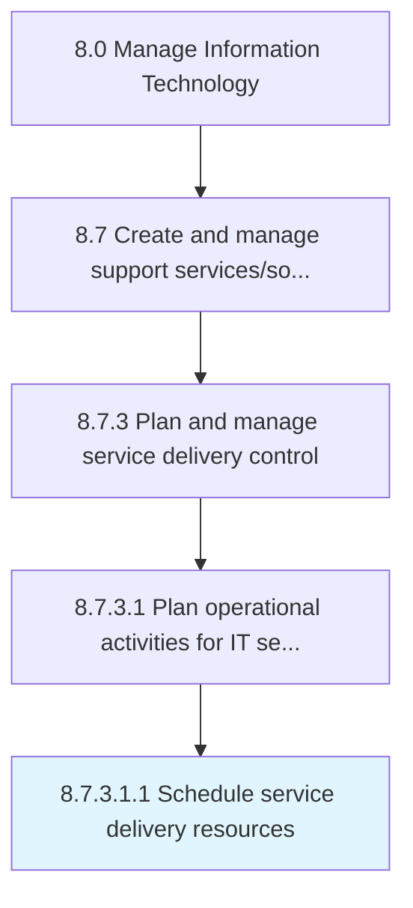

# Schedule service delivery resources

> Scheduling resources to provide service delivery to IT users.

## Overview

Sub-Activity 8.7.3.1.1 is an activity within the Manage Information Technology framework. 

Scheduling resources to provide service delivery to IT users. Ensure design, development, deployment, and operations are aligned with the business objectives.

## Process Hierarchy



## Key Statistics

| Metric | Value |
|--------|-------|
| APQC Code | 20882 |
| Hierarchy ID | 8.7.3.1.1 |
| Level | Sub-Activity |
| Parent | [8.7.3.1](../) |
| Sub-Processes | 0 |


## GraphDL Semantic Structure

```
schedule.ServiceDeliveryResources
```

| Component | Value | Description |
|-----------|-------|-------------|
| Verb | `schedule` | Primary action |
| Object | `service delivery resources` | Direct object |


## Related Concepts

- ServiceDeliveryResources


---

*Source: APQC PCF 20882 (8.7.3.1.1) - APQC*
