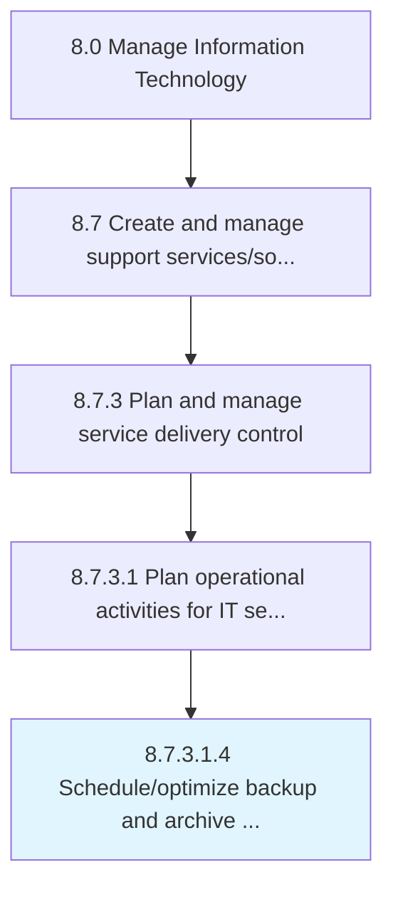

# Schedule/optimize backup and archive activities

> Schedule or optimize backup and archive activities for IT services and solutions.

## Overview

Sub-Activity 8.7.3.1.4 is an activity within the Manage Information Technology framework. 

Schedule or optimize backup and archive activities for IT services and solutions. Use a backup system or application and archive operations data for future retrieval.

## Process Hierarchy



## Key Statistics

| Metric | Value |
|--------|-------|
| APQC Code | 20885 |
| Hierarchy ID | 8.7.3.1.4 |
| Level | Sub-Activity |
| Parent | [8.7.3.1](../) |
| Sub-Processes | 0 |


## GraphDL Semantic Structure

```
schedule/optimize.BackupAndArchiveActivities
```

| Component | Value | Description |
|-----------|-------|-------------|
| Verb | `schedule/optimize` | Primary action |
| Object | `backup and archive activities` | Direct object |


## Related Concepts

- BackupArchiveActivities
- BackupArchiveActivities


---

*Source: APQC PCF 20885 (8.7.3.1.4) - APQC*
