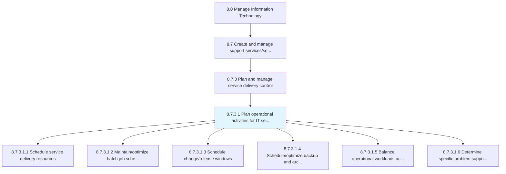
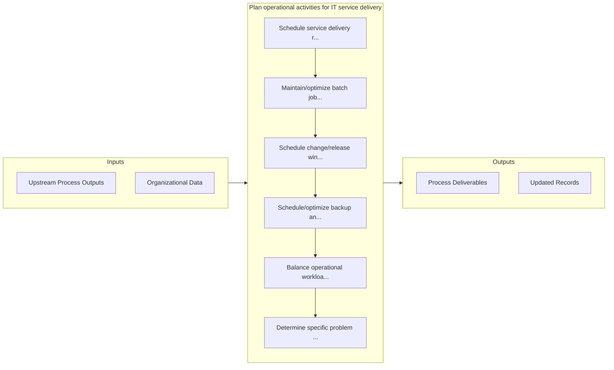

# Plan operational activities for IT service delivery

> Planning different delivery services for operational activities within the IT function.

## Overview

Activity 8.7.3.1 is an activity within the Manage Information Technology framework. 

Planning different delivery services for operational activities within the IT function. Use service delivery systems to manage the IT service delivery services.

## Process Hierarchy



## Key Statistics

| Metric | Value |
|--------|-------|
| APQC Code | 20881 |
| Hierarchy ID | 8.7.3.1 |
| Level | Activity |
| Parent | [8.7.3](../) |
| Sub-Processes | 6 |


## GraphDL Semantic Structure

```graphdl
plan.OperationalActivities.for.ITServiceDelivery
```

| Component | Value | Description |
|-----------|-------|-------------|
| Verb | `plan` | Primary action |
| Object | `operational activities` | Direct object |
| Preposition | `for` | Relationship |
| PrepObject | `IT service delivery` | Indirect object |


## Process Flow



## Sub-Processes

| Process | Hierarchy ID | Description |
|---------|-------------|-------------|
| [Schedule service delivery resources](./ScheduleServiceDeliveryResources) | 8.7.3.1.1 | Scheduling resources to provide service delivery to IT users |
| [Maintain/optimize batch job schedule](./MaintainoptimizeBatchJobSchedule) | 8.7.3.1.2 | Maintaining and scheduling batch jobs to run in the background at a certain date and time |
| [Schedule change/release windows](./ScheduleChangereleaseWindows) | 8.7.3.1.3 | Determine the timely change or release of IT services or support |
| [Schedule/optimize backup and archive activities](./ScheduleoptimizeBackupAndArchiveActivities) | 8.7.3.1.4 | Schedule or optimize backup and archive activities for IT services and solutions |
| [Balance operational workloads across available infrastructure components](./BalanceOperationalWorkloadsAcrossAvailableInfrastructureComponents) | 8.7.3.1.5 | Balancing workloads of all the processes and services that are provisioned to their internal or exte |
| [Determine specific problem support procedures](./DetermineSpecificProblemSupportProcedures) | 8.7.3.1.6 | Determining process and procedure to provide support for specific IT service problems |


## Related Concepts

- OperationalActivities
- ITServiceDelivery


---

*Source: APQC PCF 20881 (8.7.3.1) - APQC*
