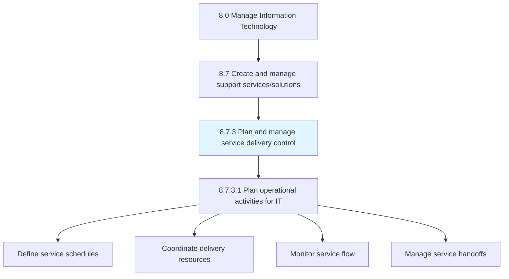
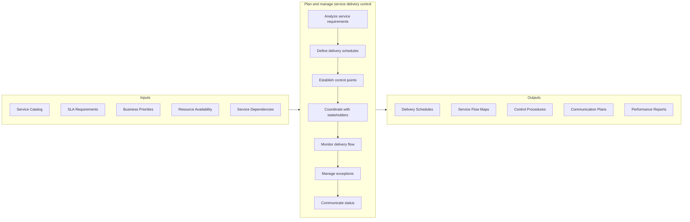
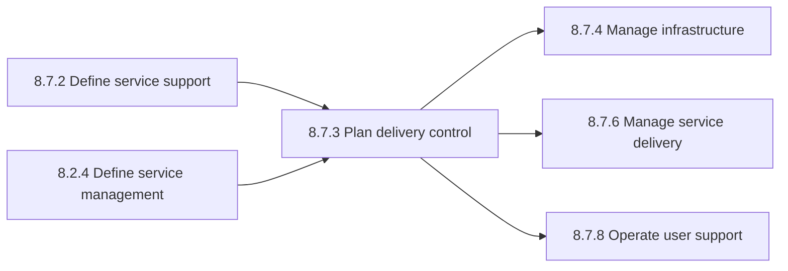

# Plan and manage service delivery control

> Determine and manage service delivery flow across different business functions.

## Overview

Process 8.7.3 is a core process that defines the specific procedures for plan and manage service delivery control. This process establishes the operational framework for coordinating IT service delivery across the organization.

Determine and manage service delivery flow across different business functions. Understand the level of services needed by different stakeholders. Identify major service delivery touch points and criticality associated. Ensure timely communication with users.

Effective service delivery control requires a comprehensive understanding of service dependencies, business priorities, and operational constraints. This process ensures that IT services are delivered consistently, efficiently, and in alignment with business requirements. It serves as the bridge between service strategy and operational execution.

## Process Hierarchy



## Key Statistics

| Metric | Value |
|--------|-------|
| APQC Code | 20880 |
| Hierarchy ID | 8.7.3 |
| Level | Process |
| Parent | [8.7](../) |
| Sub-Processes | 1 |
| Industry Variants | 19 |

## GraphDL Semantic Structure

```graphdl
plan.ServiceDeliveryControl
manage.ServiceDeliveryControl
```

| Component | Value | Description |
|-----------|-------|-------------|
| Verb | `plan`, `manage` | Dual action of planning and ongoing management |
| Object | `service delivery control` | Mechanisms for controlling IT service delivery |

## Process Flow



## Child Process Listings

### 8.7.3.1 - Plan operational activities for IT service delivery

Planning different delivery services for operational activities within the IT function. This sub-process translates service requirements into actionable operational plans.

**Key Activities:**
- Define service delivery schedules and timelines
- Allocate resources to delivery activities
- Establish checkpoints and milestones
- Coordinate cross-functional dependencies
- Plan communication touchpoints
- Document operational procedures

[View Process Details](./8.7.3.1-PlanOperationalActivitiesIT/)

## RACI Matrix

| Activity | IT Service Delivery Manager | IT Operations Manager | Service Desk Manager | Business Relationship Manager | Change Manager | CIO |
|----------|----------------------------|----------------------|---------------------|------------------------------|----------------|-----|
| Analyze service requirements | R | C | C | A | I | I |
| Define delivery schedules | R | R | C | C | C | I |
| Establish control points | R | A | C | I | C | I |
| Coordinate with stakeholders | R | C | C | A | C | I |
| Monitor delivery flow | C | R | R | I | I | I |
| Manage exceptions | R | A | R | C | C | I |
| Communicate status | R | C | R | A | I | I |
| Review delivery performance | R | R | C | A | I | C |
| Update delivery procedures | R | A | C | C | R | I |

**Legend:** R = Responsible, A = Accountable, C = Consulted, I = Informed

## Metrics and KPIs

| Metric | Description | Target | Frequency |
|--------|-------------|--------|-----------|
| Service Delivery Adherence | Percentage of services delivered per schedule | >95% | Weekly |
| Control Point Completion | Percentage of control checkpoints passed | >98% | Per delivery |
| Stakeholder Communication Rate | Percentage of scheduled communications sent | 100% | Daily |
| Exception Resolution Time | Average time to resolve delivery exceptions | <4 hours | Per occurrence |
| Service Handoff Success Rate | Percentage of successful service transitions | >99% | Per handoff |
| Delivery Cycle Time | Average time from request to delivery | Benchmark | Monthly |
| Schedule Variance | Deviation from planned delivery schedule | <5% | Weekly |
| Resource Utilization | Percentage of delivery resources utilized | 75-85% | Weekly |
| Stakeholder Satisfaction | Satisfaction with delivery control process | >4.0/5.0 | Quarterly |
| Process Compliance Rate | Adherence to delivery control procedures | >95% | Monthly |

## Related Departments

- [IT Operations](/departments/IT/Operations) - Operational service delivery execution
- [IT Service Management](/departments/IT/ServiceManagement) - ITSM process coordination
- [Business Relationship Management](/departments/IT/BRM) - Stakeholder coordination
- [Change Management](/departments/IT/ChangeManagement) - Delivery change coordination
- [Service Desk](/departments/IT/ServiceDesk) - User communication and support
- [Project Management Office](/departments/PMO) - Delivery planning alignment

## Related Occupations

- [Computer and Information Systems Managers](/occupations/Technology/Management/ComputerInformationSystemsManagers) - IT service oversight
- [Computer Systems Analysts](/occupations/Technology/Analysis/ComputerSystemsAnalysts) - Service requirements analysis
- [Network and Computer Systems Administrators](/occupations/Technology/Infrastructure/NetworkAdministrators) - Service delivery execution
- [Computer User Support Specialists](/occupations/Technology/Support/ComputerUserSupportSpecialists) - User communication
- [Project Management Specialists](/occupations/Business/ProjectManagement/ProjectManagementSpecialists) - Delivery coordination
- [Management Analysts](/occupations/Business/Operations/ManagementAnalysts) - Process improvement

## Related Concepts

- ServiceDeliveryControl
- ITServiceManagement
- OperationalPlanning
- ServiceCoordination
- StakeholderCommunication
- DeliveryScheduling

## Related Processes



---

*Source: APQC PCF 20880 (8.7.3) - APQC*
