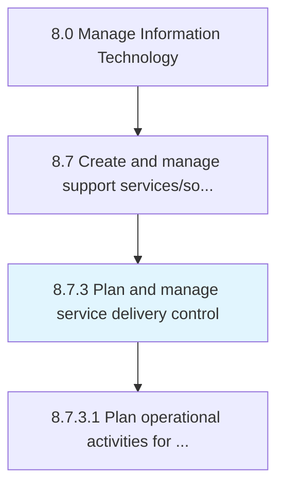
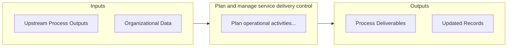

# Plan and manage service delivery control

> Determine and manage service delivery flow across different business functions.

## Overview

Process 8.7.3 is a core process that defines the specific procedures for plan and manage service delivery control. 

Determine and manage service delivery flow across different business functions. Understand the level of services needed by different stakeholders. Identify major service delivery touch points and criticality associated. Ensure timely communication with users.

## Process Hierarchy



## Key Statistics

| Metric | Value |
|--------|-------|
| APQC Code | 20880 |
| Hierarchy ID | 8.7.3 |
| Level | Process |
| Parent | [8.7](../) |
| Sub-Processes | 1 |


## GraphDL Semantic Structure

```
plan.AndManageServiceDeliveryControl
```

| Component | Value | Description |
|-----------|-------|-------------|
| Verb | `plan` | Primary action |
| Object | `and manage service delivery control` | Direct object |


## Process Flow



## Sub-Processes

| Process | Hierarchy ID | Description |
|---------|-------------|-------------|
| [Plan operational activities for IT service delivery](./8.7.3.1-PlanOperationalActivitiesIT/) | 8.7.3.1 | Planning different delivery services for operational activities within the IT function |


## Related Concepts

- [ServiceDeliveryControl](/concepts/ServiceDeliveryControl)
- [ServiceDeliveryControl](/concepts/ServiceDeliveryControl)


---

*Source: APQC PCF 20880 (8.7.3) - APQC*
