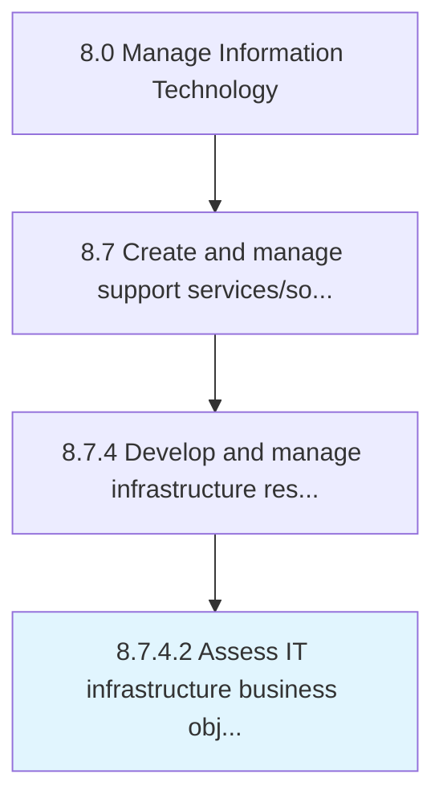

# Assess IT infrastructure business objectives

> Assessing the goals and objectives of IT infrastructure and how it contributes to the overall business objectives.

## Overview

Activity 8.7.4.2 is an activity within the Manage Information Technology framework. 

Assessing the goals and objectives of IT infrastructure and how it contributes to the overall business objectives.

## Process Hierarchy



## Key Statistics

| Metric | Value |
|--------|-------|
| APQC Code | 20890 |
| Hierarchy ID | 8.7.4.2 |
| Level | Activity |
| Parent | [8.7.4](../) |
| Sub-Processes | 0 |


## GraphDL Semantic Structure

```
assess.ITInfrastructureBusinessObjectives
```

| Component | Value | Description |
|-----------|-------|-------------|
| Verb | `assess` | Primary action |
| Object | `IT infrastructure business objectives` | Direct object |


## Related Concepts

- ITInfrastructureBusinessObjectives


---

*Source: APQC PCF 20890 (8.7.4.2) - APQC*
