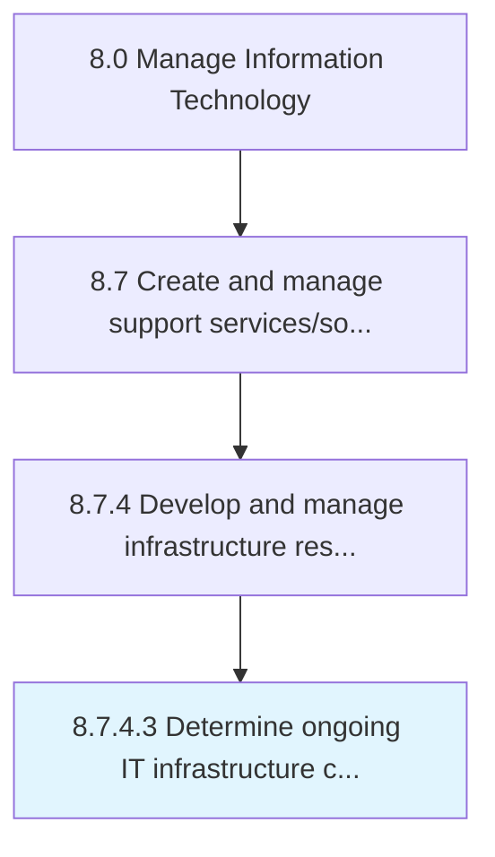

# Determine ongoing IT infrastructure capabilities

> Determining existing IT infrastructure capabilities.

## Overview

Activity 8.7.4.3 is an activity within the Manage Information Technology framework. 

Determining existing IT infrastructure capabilities. Identify the gaps and needs in order to enhance the existing IT infrastructure to meet growth objectives.

## Process Hierarchy



## Key Statistics

| Metric | Value |
|--------|-------|
| APQC Code | 20891 |
| Hierarchy ID | 8.7.4.3 |
| Level | Activity |
| Parent | [8.7.4](../) |
| Sub-Processes | 0 |


## GraphDL Semantic Structure

```
determine.OngoingITInfrastructureCapabilities
```

| Component | Value | Description |
|-----------|-------|-------------|
| Verb | `determine` | Primary action |
| Object | `ongoing IT infrastructure capabilities` | Direct object |


## Related Concepts

- OngoingITInfrastructureCapabilities


---

*Source: APQC PCF 20891 (8.7.4.3) - APQC*
