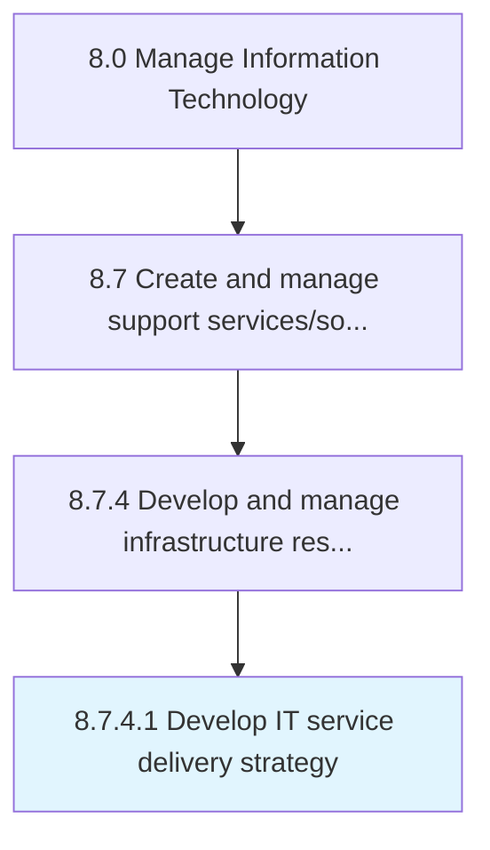

# Develop IT service delivery strategy

> Creating a strategy for delivering IT services and solutions.

## Overview

Activity 8.7.4.1 is an activity within the Manage Information Technology framework. 

Creating a strategy for delivering IT services and solutions. Establish the sourcing strategy. Establish the delivery process procedures and tools. Examine and choose the most effective methodologies and tools.

## Process Hierarchy



## Key Statistics

| Metric | Value |
|--------|-------|
| APQC Code | 20889 |
| Hierarchy ID | 8.7.4.1 |
| Level | Activity |
| Parent | [8.7.4](../) |
| Sub-Processes | 0 |


## GraphDL Semantic Structure

```
develop.ITServiceDeliveryStrategy
```

| Component | Value | Description |
|-----------|-------|-------------|
| Verb | `develop` | Primary action |
| Object | `IT service delivery strategy` | Direct object |


## Related Concepts

- ITServiceDeliveryStrategy


---

*Source: APQC PCF 20889 (8.7.4.1) - APQC*
