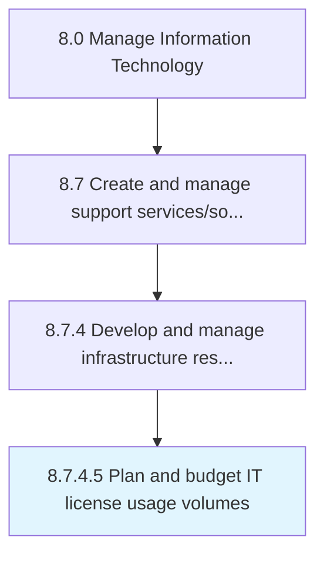

# Plan and budget IT license usage volumes

> Creating a plan associated with usage volumes of IT licenses.

## Overview

Activity 8.7.4.5 is an activity within the Manage Information Technology framework. 

Creating a plan associated with usage volumes of IT licenses. Develop a framework to govern the licensing of an IT services along with identified usage volumes. Determine the amount of investment in IT license usage volumes and how would the license volumes be financed.

## Process Hierarchy



## Key Statistics

| Metric | Value |
|--------|-------|
| APQC Code | 20893 |
| Hierarchy ID | 8.7.4.5 |
| Level | Activity |
| Parent | [8.7.4](../) |
| Sub-Processes | 0 |


## GraphDL Semantic Structure

```
plan.AndBudgetITLicenseUsageVolumes
```

| Component | Value | Description |
|-----------|-------|-------------|
| Verb | `plan` | Primary action |
| Object | `and budget IT license usage volumes` | Direct object |


## Related Concepts

- [ITLicenseUsageVolumes](/concepts/ITLicenseUsageVolumes)
- [ITLicenseUsageVolumes](/concepts/ITLicenseUsageVolumes)


---

*Source: APQC PCF 20893 (8.7.4.5) - APQC*
