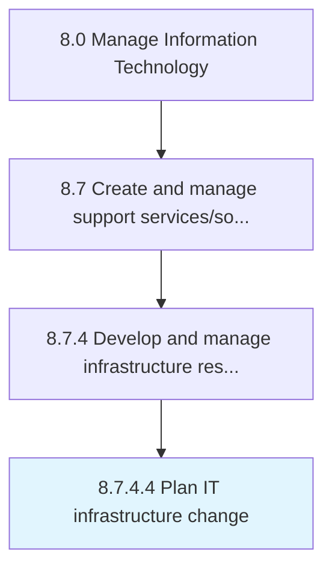

# Plan IT infrastructure change

> Identify the gaps and needs of existing IT infrastructure.

## Overview

Activity 8.7.4.4 is an activity within the Manage Information Technology framework. 

Identify the gaps and needs of existing IT infrastructure. Plan and develop strategies to upgrade/replace existing IT infrastructure.

## Process Hierarchy



## Key Statistics

| Metric | Value |
|--------|-------|
| APQC Code | 20892 |
| Hierarchy ID | 8.7.4.4 |
| Level | Activity |
| Parent | [8.7.4](../) |
| Sub-Processes | 0 |


## GraphDL Semantic Structure

```
plan.ITInfrastructureChange
```

| Component | Value | Description |
|-----------|-------|-------------|
| Verb | `plan` | Primary action |
| Object | `IT infrastructure change` | Direct object |


## Related Concepts

- ITInfrastructureChange


---

*Source: APQC PCF 20892 (8.7.4.4) - APQC*
