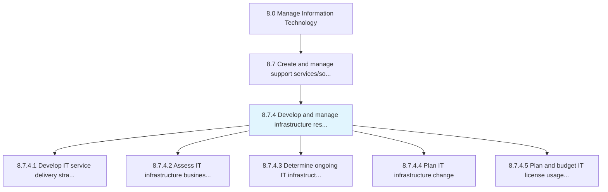
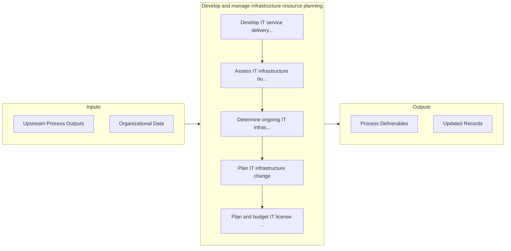

# Develop and manage infrastructure resource planning

> Developing and managing the resources required for administration of infrastructure.

## Overview

Process 8.7.4 is a core process that defines the specific procedures for develop and manage infrastructure resource planning. 

Developing and managing the resources required for administration of infrastructure. Manage the IT inventory and assets to meet organization's IT resource capacity.

## Process Hierarchy



## Key Statistics

| Metric | Value |
|--------|-------|
| APQC Code | 20888 |
| Hierarchy ID | 8.7.4 |
| Level | Process |
| Parent | [8.7](../) |
| Sub-Processes | 5 |


## GraphDL Semantic Structure

```
develop.AndManageInfrastructureResourcePlanning
```

| Component | Value | Description |
|-----------|-------|-------------|
| Verb | `develop` | Primary action |
| Object | `and manage infrastructure resource planning` | Direct object |


## Process Flow



## Sub-Processes

| Process | Hierarchy ID | Description |
|---------|-------------|-------------|
| [Develop IT service delivery strategy](./DevelopITServiceDeliveryStrategy) | 8.7.4.1 | Creating a strategy for delivering IT services and solutions |
| [Assess IT infrastructure business objectives](./AssessITInfrastructureBusinessObjectives) | 8.7.4.2 | Assessing the goals and objectives of IT infrastructure and how it contributes to the overall busine |
| [Determine ongoing IT infrastructure capabilities](./DetermineOngoingITInfrastructureCapabilities) | 8.7.4.3 | Determining existing IT infrastructure capabilities |
| [Plan IT infrastructure change](./PlanITInfrastructureChange) | 8.7.4.4 | Identify the gaps and needs of existing IT infrastructure |
| [Plan and budget IT license usage volumes](./PlanAndBudgetITLicenseUsageVolumes) | 8.7.4.5 | Creating a plan associated with usage volumes of IT licenses |


## Related Concepts

- [InfrastructureResourcePlanning](/concepts/InfrastructureResourcePlanning)
- [InfrastructureResourcePlanning](/concepts/InfrastructureResourcePlanning)


---

*Source: APQC PCF 20888 (8.7.4) - APQC*
