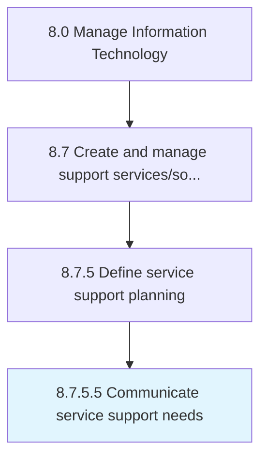

# Communicate service support needs

> Conveying service support needs within the organization, with the objective of providing required support services.

## Overview

Activity 8.7.5.5 is an activity within the Manage Information Technology framework. 

Conveying service support needs within the organization, with the objective of providing required support services. Define processes and procedures needed to support users of IT services and solutions. Convey these procedures to appropriate governing authority.

## Process Hierarchy



## Key Statistics

| Metric | Value |
|--------|-------|
| APQC Code | 20899 |
| Hierarchy ID | 8.7.5.5 |
| Level | Activity |
| Parent | [8.7.5](../) |
| Sub-Processes | 0 |


## GraphDL Semantic Structure

```
communicate.ServiceSupportNeeds
```

| Component | Value | Description |
|-----------|-------|-------------|
| Verb | `communicate` | Primary action |
| Object | `service support needs` | Direct object |


## Related Concepts

- [ServiceSupportNeeds](/concepts/ServiceSupportNeeds)


---

*Source: APQC PCF 20899 (8.7.5.5) - APQC*
