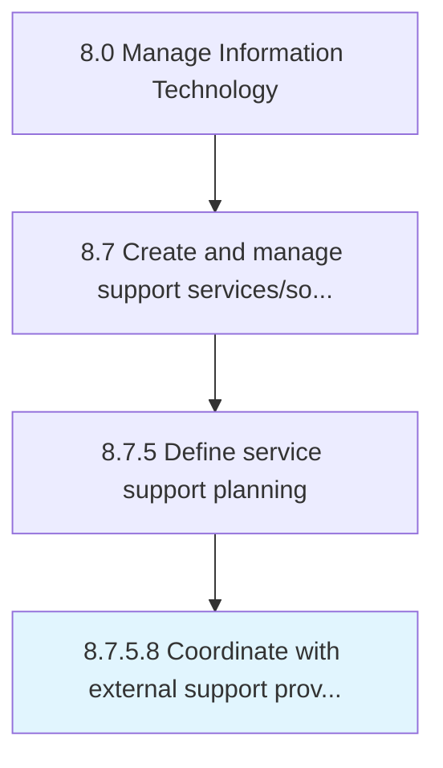

# Coordinate with external support providers

> Developing a strategy that will make use of multiple resources to coordinate with external support providers in order to make the support services work more smoother.

## Overview

Activity 8.7.5.8 is an activity within the Manage Information Technology framework. 

Developing a strategy that will make use of multiple resources to coordinate with external support providers in order to make the support services work more smoother.

## Process Hierarchy



## Key Statistics

| Metric | Value |
|--------|-------|
| APQC Code | 20902 |
| Hierarchy ID | 8.7.5.8 |
| Level | Activity |
| Parent | [8.7.5](../) |
| Sub-Processes | 0 |


## GraphDL Semantic Structure

```
coordinate.WithExternalSupportProviders
```

| Component | Value | Description |
|-----------|-------|-------------|
| Verb | `coordinate` | Primary action |
| Object | `with external support providers` | Direct object |


## Related Concepts

- ExternalSupportProviders


---

*Source: APQC PCF 20902 (8.7.5.8) - APQC*
