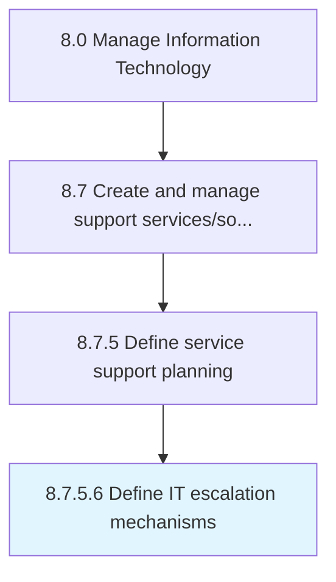

# Define IT escalation mechanisms

> Determining mechanisms to report for a higher degree of decision making depending on the criticality of IT escalations.

## Overview

Activity 8.7.5.6 is an activity within the Manage Information Technology framework. 

Determining mechanisms to report for a higher degree of decision making depending on the criticality of IT escalations. Define the processes and procedures needed to follow for IT escalation at different levels. Convey the mechanisms within the organization.

## Process Hierarchy



## Key Statistics

| Metric | Value |
|--------|-------|
| APQC Code | 20900 |
| Hierarchy ID | 8.7.5.6 |
| Level | Activity |
| Parent | [8.7.5](../) |
| Sub-Processes | 0 |


## GraphDL Semantic Structure

```
define.ITEscalationMechanisms
```

| Component | Value | Description |
|-----------|-------|-------------|
| Verb | `define` | Primary action |
| Object | `IT escalation mechanisms` | Direct object |


## Related Concepts

- [ITEscalationMechanisms](/concepts/ITEscalationMechanisms)


---

*Source: APQC PCF 20900 (8.7.5.6) - APQC*
