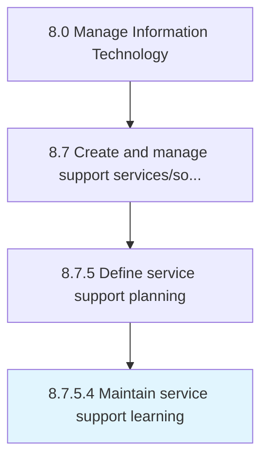

# Maintain service support learning

> Maintaining and transfer of knowledge towards service support with the change/upgrade in technology over a stipulated period.

## Overview

Activity 8.7.5.4 is an activity within the Manage Information Technology framework. 

Maintaining and transfer of knowledge towards service support with the change/upgrade in technology over a stipulated period. Ensure IT staff is well trained and tested on the new learning of service support.

## Process Hierarchy



## Key Statistics

| Metric | Value |
|--------|-------|
| APQC Code | 20943 |
| Hierarchy ID | 8.7.5.4 |
| Level | Activity |
| Parent | [8.7.5](../) |
| Sub-Processes | 0 |


## GraphDL Semantic Structure

```
maintain.ServiceSupportLearning
```

| Component | Value | Description |
|-----------|-------|-------------|
| Verb | `maintain` | Primary action |
| Object | `service support learning` | Direct object |


## Related Concepts

- ServiceSupportLearning


---

*Source: APQC PCF 20943 (8.7.5.4) - APQC*
