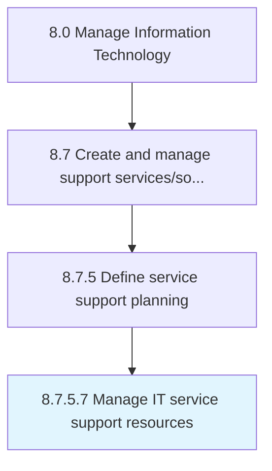

# Manage IT service support resources

> Managing resources required for administration of IT service support.

## Overview

Activity 8.7.5.7 is an activity within the Manage Information Technology framework. 

Managing resources required for administration of IT service support. Establish sources that will make use of e-mail, live support software online, or a tool where users can log a call or incident in order to retrieve IT support.

## Process Hierarchy



## Key Statistics

| Metric | Value |
|--------|-------|
| APQC Code | 20901 |
| Hierarchy ID | 8.7.5.7 |
| Level | Activity |
| Parent | [8.7.5](../) |
| Sub-Processes | 0 |


## GraphDL Semantic Structure

```
manage.ITServiceSupportResources
```

| Component | Value | Description |
|-----------|-------|-------------|
| Verb | `manage` | Primary action |
| Object | `IT service support resources` | Direct object |


## Related Concepts

- [ITServiceSupportResources](/concepts/ITServiceSupportResources)


---

*Source: APQC PCF 20901 (8.7.5.7) - APQC*
