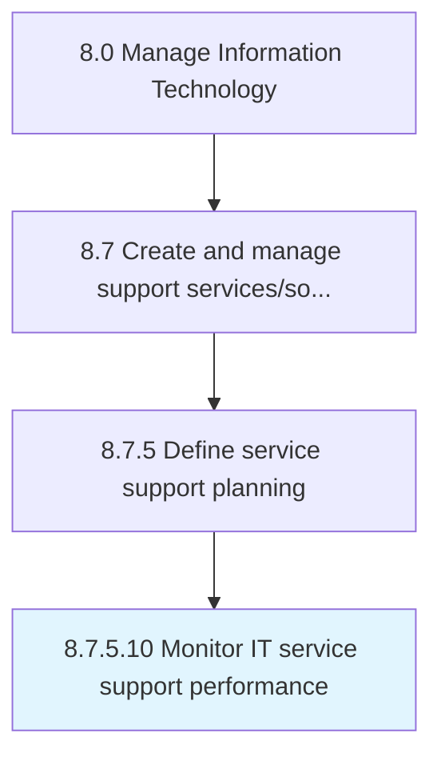

# Monitor IT service support performance

> Defining methodology and frequency of assessment for measuring and monitoring performance of various processes and activities of IT service support against standard set goals.

## Overview

Activity 8.7.5.10 is an activity within the Manage Information Technology framework. 

Defining methodology and frequency of assessment for measuring and monitoring performance of various processes and activities of IT service support against standard set goals.

## Process Hierarchy



## Key Statistics

| Metric | Value |
|--------|-------|
| APQC Code | 20904 |
| Hierarchy ID | 8.7.5.10 |
| Level | Activity |
| Parent | [8.7.5](../) |
| Sub-Processes | 0 |


## GraphDL Semantic Structure

```
monitor.ITServiceSupportPerformance
```

| Component | Value | Description |
|-----------|-------|-------------|
| Verb | `monitor` | Primary action |
| Object | `IT service support performance` | Direct object |


## Related Concepts

- ITServiceSupportPerformance


---

*Source: APQC PCF 20904 (8.7.5.10) - APQC*
