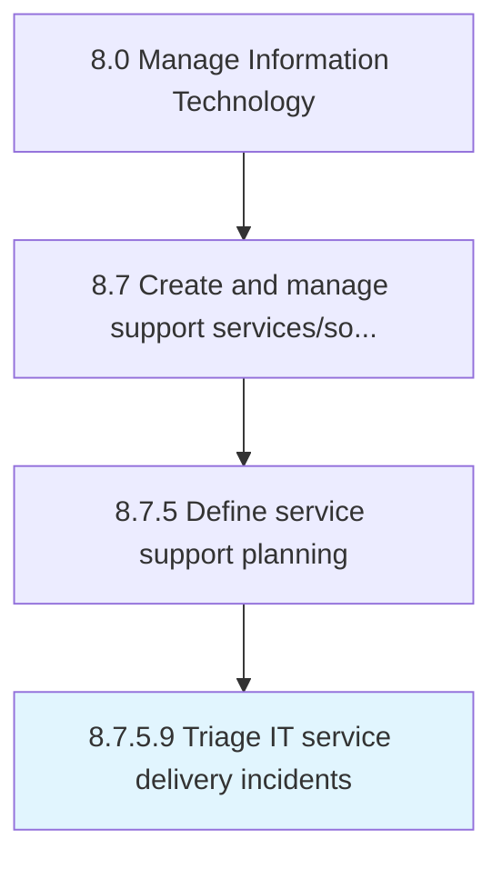

# Triage IT service delivery incidents

> Sorting the incidents of IT service delivery in certain order so that the services could be delivered based on the criticality.

## Overview

Activity 8.7.5.9 is an activity within the Manage Information Technology framework. 

Sorting the incidents of IT service delivery in certain order so that the services could be delivered based on the criticality.

## Process Hierarchy



## Key Statistics

| Metric | Value |
|--------|-------|
| APQC Code | 20903 |
| Hierarchy ID | 8.7.5.9 |
| Level | Activity |
| Parent | [8.7.5](../) |
| Sub-Processes | 0 |


## GraphDL Semantic Structure

```
triage.ITServiceDeliveryIncidents
```

| Component | Value | Description |
|-----------|-------|-------------|
| Verb | `triage` | Primary action |
| Object | `IT service delivery incidents` | Direct object |


## Related Concepts

- [ITServiceDeliveryIncidents](/concepts/ITServiceDeliveryIncidents)


---

*Source: APQC PCF 20903 (8.7.5.9) - APQC*
