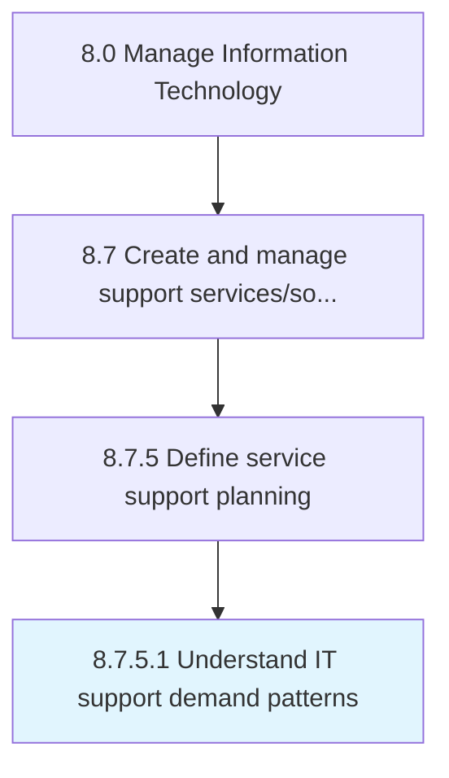

# Understand IT support demand patterns

> Evaluate criticality catered by the IT support and expectations to resolve raised or identified issues.

## Overview

Activity 8.7.5.1 is an activity within the Manage Information Technology framework. 

Evaluate criticality catered by the IT support and expectations to resolve raised or identified issues. Determine the usual requests received for IT support for each area of IT operations. Ensure resolution to every identified or reported issue within specified SLAs.

## Process Hierarchy



## Key Statistics

| Metric | Value |
|--------|-------|
| APQC Code | 20896 |
| Hierarchy ID | 8.7.5.1 |
| Level | Activity |
| Parent | [8.7.5](../) |
| Sub-Processes | 0 |


## GraphDL Semantic Structure

```
understand.ITSupportDemandPatterns
```

| Component | Value | Description |
|-----------|-------|-------------|
| Verb | `understand` | Primary action |
| Object | `IT support demand patterns` | Direct object |


## Related Concepts

- ITSupportDemandPatterns


---

*Source: APQC PCF 20896 (8.7.5.1) - APQC*
