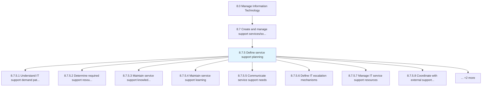
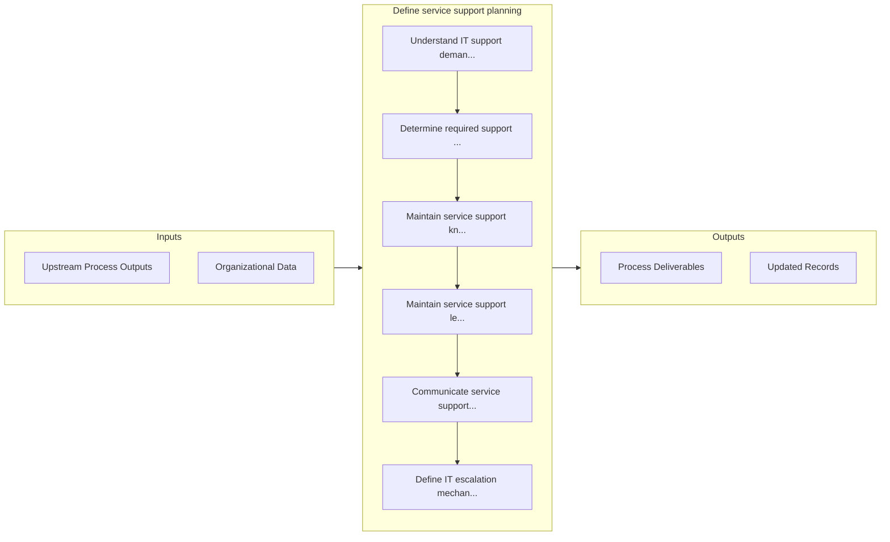

# Define service support planning

> Develop strategies and methodologies to provide service support.

## Overview

Process 8.7.5 is a core process that defines the specific procedures for define service support planning. 

Develop strategies and methodologies to provide service support. Examine service levels, support complexity, stakeholder requirements to offer service support.

## Process Hierarchy



## Key Statistics

| Metric | Value |
|--------|-------|
| APQC Code | 20895 |
| Hierarchy ID | 8.7.5 |
| Level | Process |
| Parent | [8.7](../) |
| Sub-Processes | 10 |


## GraphDL Semantic Structure

```graphdl
define.ServiceSupportPlanning
```

| Component | Value | Description |
|-----------|-------|-------------|
| Verb | `define` | Primary action |
| Object | `service support planning` | Direct object |


## Process Flow



## Sub-Processes

| Process | Hierarchy ID | Description |
|---------|-------------|-------------|
| [Understand IT support demand patterns](./UnderstandITSupportDemandPatterns) | 8.7.5.1 | Evaluate criticality catered by the IT support and expectations to resolve raised or identified issu |
| [Determine required support resource levels, responsibilities, and capabilities](./DetermineRequiredSupportResourceLevelsResponsibilitiesAndCapabilities) | 8.7.5.2 | Determining levels of required support resources along with their responsibilities, and capabilities |
| [Maintain service support knowledge repository](./MaintainServiceSupportKnowledgeRepository) | 8.7.5.3 | Create and maintain service support knowledge repository |
| [Maintain service support learning](./MaintainServiceSupportLearning) | 8.7.5.4 | Maintaining and transfer of knowledge towards service support with the change/upgrade in technology  |
| [Communicate service support needs](./CommunicateServiceSupportNeeds) | 8.7.5.5 | Conveying service support needs within the organization, with the objective of providing required su |
| [Define IT escalation mechanisms](./DefineITEscalationMechanisms) | 8.7.5.6 | Determining mechanisms to report for a higher degree of decision making depending on the criticality |
| [Manage IT service support resources](./ManageITServiceSupportResources) | 8.7.5.7 | Managing resources required for administration of IT service support |
| [Coordinate with external support providers](./CoordinateWithExternalSupportProviders) | 8.7.5.8 | Developing a strategy that will make use of multiple resources to coordinate with external support p |
| [Triage IT service delivery incidents](./TriageITServiceDeliveryIncidents) | 8.7.5.9 | Sorting the incidents of IT service delivery in certain order so that the services could be delivere |
| [Monitor IT service support performance](./MonitorITServiceSupportPerformance) | 8.7.5.10 | Defining methodology and frequency of assessment for measuring and monitoring performance of various |


## Related Concepts

- ServiceSupportPlanning


---

*Source: APQC PCF 20895 (8.7.5) - APQC*
