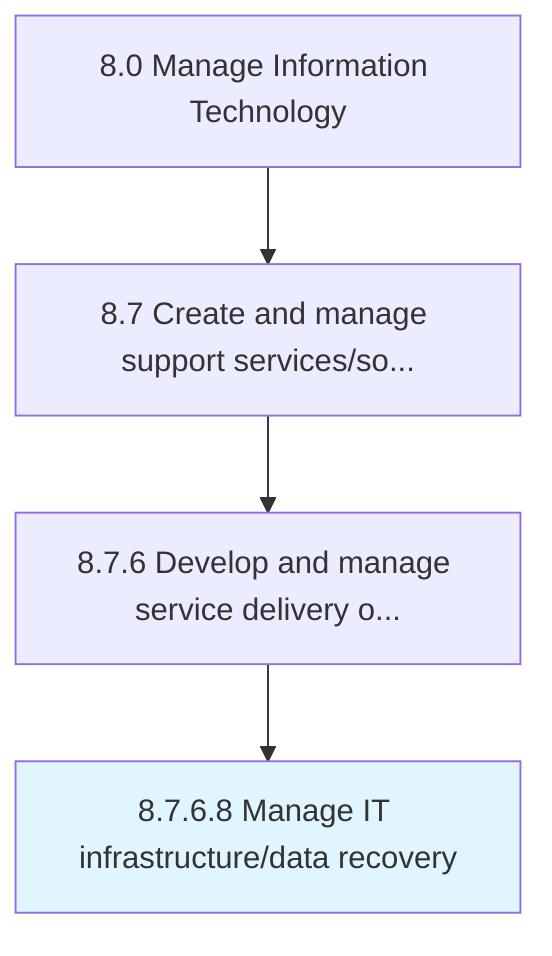

# Manage IT infrastructure/data recovery

> Managing resources of IT infrastructure and their recovery capacity.

## Overview

Activity 8.7.6.8 is an activity within the Manage Information Technology framework. 

Managing resources of IT infrastructure and their recovery capacity. Manage storage, computer hardware, software, and infrastructure resources that can be stored as inventory or provided by the organization as needed. Managing backup/recovery for IT services and solutions. Use a backup system or application.

## Process Hierarchy



## Key Statistics

| Metric | Value |
|--------|-------|
| APQC Code | 20913 |
| Hierarchy ID | 8.7.6.8 |
| Level | Activity |
| Parent | [8.7.6](../) |
| Sub-Processes | 0 |


## GraphDL Semantic Structure

```
manage.ITInfrastructuredataRecovery
```

| Component | Value | Description |
|-----------|-------|-------------|
| Verb | `manage` | Primary action |
| Object | `IT infrastructure/data recovery` | Direct object |


## Related Concepts

- ITInfrastructureRecovery
- ITDataRecovery


---

*Source: APQC PCF 20913 (8.7.6.8) - APQC*
