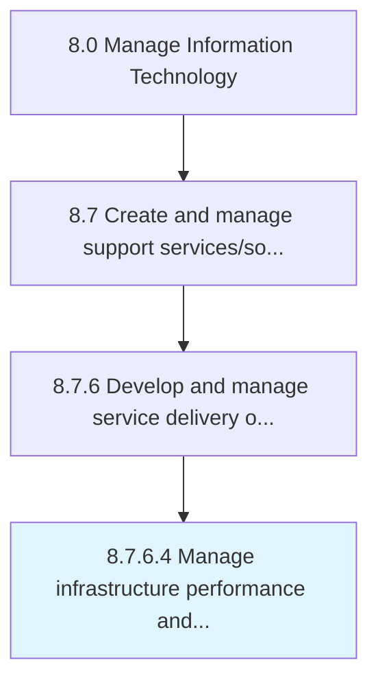

# Manage infrastructure performance and capacity

> Managing the performance and capacity of infrastructure by using key performance indicators to routinely track the performance and capacity levels.

## Overview

Activity 8.7.6.4 is an activity within the Manage Information Technology framework. 

Managing the performance and capacity of infrastructure by using key performance indicators to routinely track the performance and capacity levels. Review performance. Evaluate the efficiency and effectiveness of the infrastructure.

## Process Hierarchy



## Key Statistics

| Metric | Value |
|--------|-------|
| APQC Code | 20909 |
| Hierarchy ID | 8.7.6.4 |
| Level | Activity |
| Parent | [8.7.6](../) |
| Sub-Processes | 0 |


## GraphDL Semantic Structure

```
manage.InfrastructurePerformanceAndCapacity
```

| Component | Value | Description |
|-----------|-------|-------------|
| Verb | `manage` | Primary action |
| Object | `infrastructure performance and capacity` | Direct object |


## Related Concepts

- [InfrastructurePerformance](/concepts/InfrastructurePerformance)
- [Capacity](/concepts/Capacity)


---

*Source: APQC PCF 20909 (8.7.6.4) - APQC*
