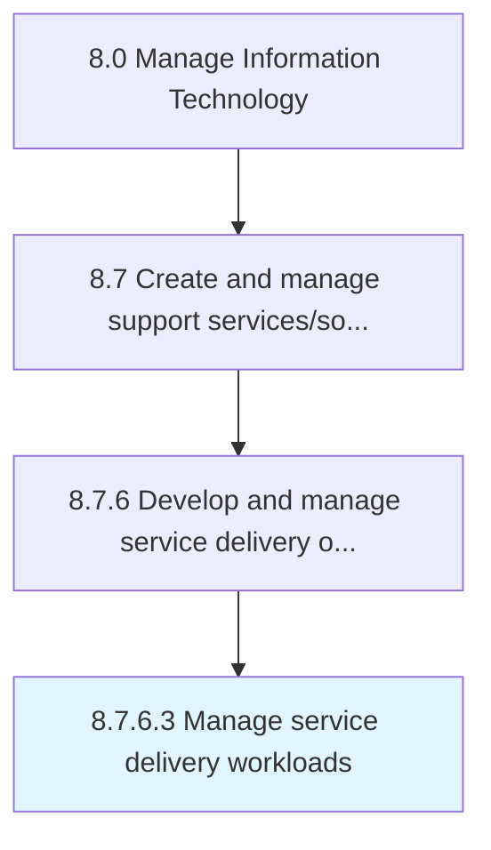

# Manage service delivery workloads

> Analyze and manage workload needs in relation to service delivery.

## Overview

Activity 8.7.6.3 is an activity within the Manage Information Technology framework. 

Analyze and manage workload needs in relation to service delivery. Plan resources and mechanism around those workload needs so that services could be delivered smoothly.

## Process Hierarchy



## Key Statistics

| Metric | Value |
|--------|-------|
| APQC Code | 20908 |
| Hierarchy ID | 8.7.6.3 |
| Level | Activity |
| Parent | [8.7.6](../) |
| Sub-Processes | 0 |


## GraphDL Semantic Structure

```
manage.ServiceDeliveryWorkloads
```

| Component | Value | Description |
|-----------|-------|-------------|
| Verb | `manage` | Primary action |
| Object | `service delivery workloads` | Direct object |


## Related Concepts

- ServiceDeliveryWorkloads


---

*Source: APQC PCF 20908 (8.7.6.3) - APQC*
