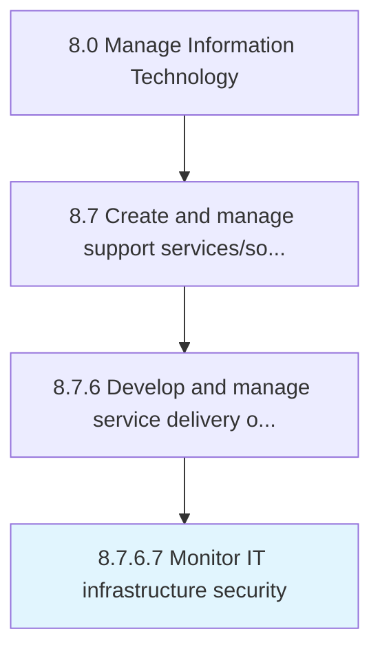

# Monitor IT infrastructure security

> Identifying, examining, and recognizing any flaw or breach in security of IT infrastructure.

## Overview

Activity 8.7.6.7 is an activity within the Manage Information Technology framework. 

Identifying, examining, and recognizing any flaw or breach in security of IT infrastructure. Ensure that protocols and guidelines for individual IT components are being followed and there is no misuse of information and breach of individual or organizational privacy.

## Process Hierarchy



## Key Statistics

| Metric | Value |
|--------|-------|
| APQC Code | 20912 |
| Hierarchy ID | 8.7.6.7 |
| Level | Activity |
| Parent | [8.7.6](../) |
| Sub-Processes | 0 |


## GraphDL Semantic Structure

```
monitor.ITInfrastructureSecurity
```

| Component | Value | Description |
|-----------|-------|-------------|
| Verb | `monitor` | Primary action |
| Object | `IT infrastructure security` | Direct object |


## Related Concepts

- [ITInfrastructureSecurity](/concepts/ITInfrastructureSecurity)


---

*Source: APQC PCF 20912 (8.7.6.7) - APQC*
