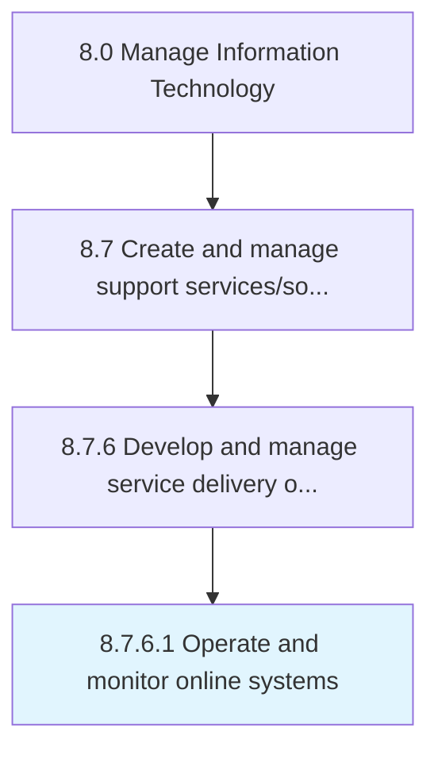

# Operate and monitor online systems

> Operating and defining methodology of assessment for measuring and monitoring performance of online systems against its expected result.

## Overview

Activity 8.7.6.1 is an activity within the Manage Information Technology framework. 

Operating and defining methodology of assessment for measuring and monitoring performance of online systems against its expected result.

## Process Hierarchy



## Key Statistics

| Metric | Value |
|--------|-------|
| APQC Code | 20906 |
| Hierarchy ID | 8.7.6.1 |
| Level | Activity |
| Parent | [8.7.6](../) |
| Sub-Processes | 0 |


## GraphDL Semantic Structure

```
operate.AndMonitorOnlineSystems
```

| Component | Value | Description |
|-----------|-------|-------------|
| Verb | `operate` | Primary action |
| Object | `and monitor online systems` | Direct object |


## Related Concepts

- OnlineSystems
- OnlineSystems


---

*Source: APQC PCF 20906 (8.7.6.1) - APQC*
