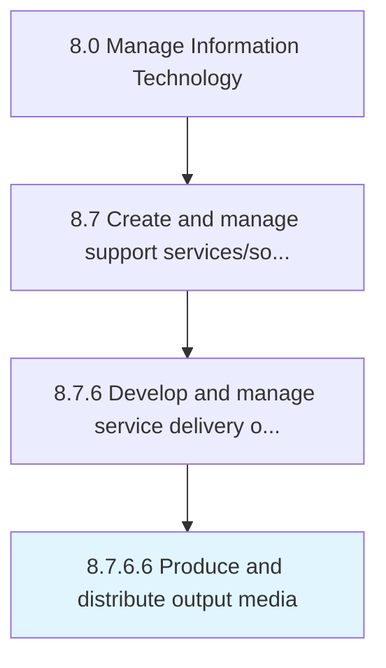

# Produce and distribute output media

> Identify and introduce resources to display output in a viewable form to key decision makers and evaluators.

## Overview

Activity 8.7.6.6 is an activity within the Manage Information Technology framework. 

Identify and introduce resources to display output in a viewable form to key decision makers and evaluators.

## Process Hierarchy



## Key Statistics

| Metric | Value |
|--------|-------|
| APQC Code | 20911 |
| Hierarchy ID | 8.7.6.6 |
| Level | Activity |
| Parent | [8.7.6](../) |
| Sub-Processes | 0 |


## GraphDL Semantic Structure

```
produce.AndDistributeOutputMedia
```

| Component | Value | Description |
|-----------|-------|-------------|
| Verb | `produce` | Primary action |
| Object | `and distribute output media` | Direct object |


## Related Concepts

- [OutputMedia](/concepts/OutputMedia)
- [OutputMedia](/concepts/OutputMedia)


---

*Source: APQC PCF 20911 (8.7.6.6) - APQC*
