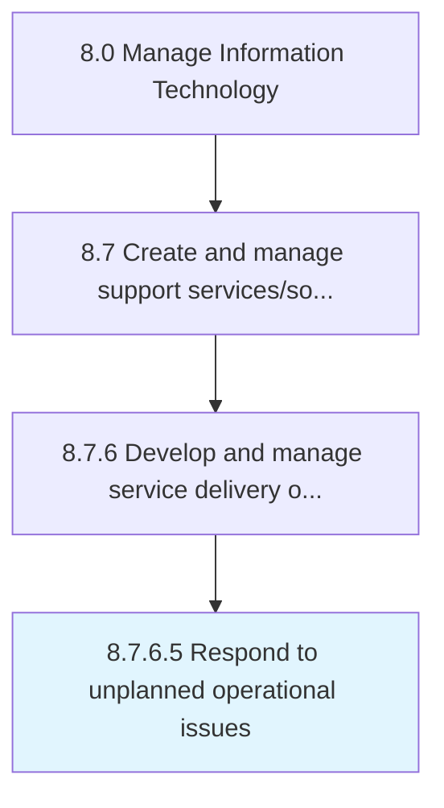

# Respond to unplanned operational issues

> Addressing to an issue in operational activities within the IT function, that occur outside of normal routine or preventative maintenance.

## Overview

Activity 8.7.6.5 is an activity within the Manage Information Technology framework. 

Addressing to an issue in operational activities within the IT function, that occur outside of normal routine or preventative maintenance.

## Process Hierarchy



## Key Statistics

| Metric | Value |
|--------|-------|
| APQC Code | 20910 |
| Hierarchy ID | 8.7.6.5 |
| Level | Activity |
| Parent | [8.7.6](../) |
| Sub-Processes | 0 |


## GraphDL Semantic Structure

```
respond.ToUnplannedOperationalIssues
```

| Component | Value | Description |
|-----------|-------|-------------|
| Verb | `respond` | Primary action |
| Object | `to unplanned operational issues` | Direct object |


## Related Concepts

- UnplannedOperationalIssues


---

*Source: APQC PCF 20910 (8.7.6.5) - APQC*
