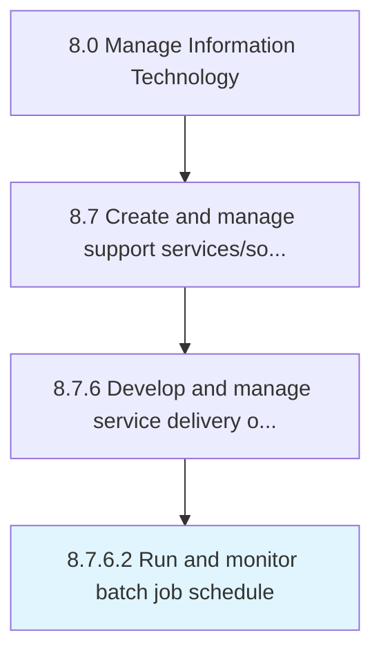

# Run and monitor batch job schedule

> Operate and monitor the application of scheduling batch jobs to be run in the background at a certain date and time.

## Overview

Activity 8.7.6.2 is an activity within the Manage Information Technology framework. 

Operate and monitor the application of scheduling batch jobs to be run in the background at a certain date and time.

## Process Hierarchy



## Key Statistics

| Metric | Value |
|--------|-------|
| APQC Code | 20907 |
| Hierarchy ID | 8.7.6.2 |
| Level | Activity |
| Parent | [8.7.6](../) |
| Sub-Processes | 0 |


## GraphDL Semantic Structure

```
run.AndMonitorBatchJobSchedule
```

| Component | Value | Description |
|-----------|-------|-------------|
| Verb | `run` | Primary action |
| Object | `and monitor batch job schedule` | Direct object |


## Related Concepts

- BatchJobSchedule
- BatchJobSchedule


---

*Source: APQC PCF 20907 (8.7.6.2) - APQC*
