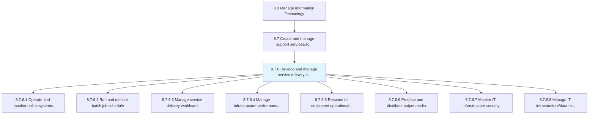
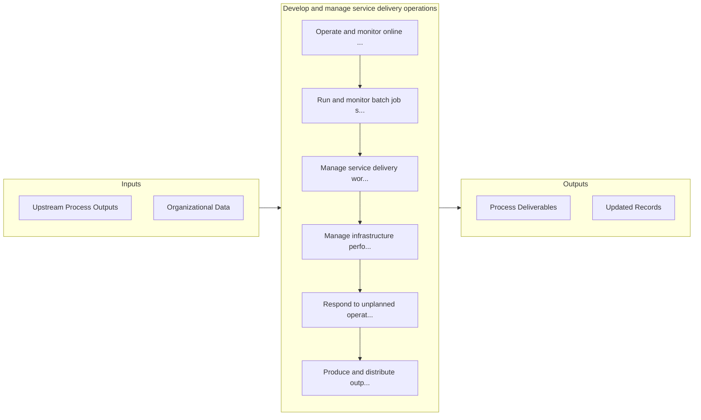

# Develop and manage service delivery operations

> Developing and managing different delivery services using service delivery systems for operational activities within the IT function in order to achieve organizations goal.

## Overview

Process 8.7.6 is a core process that defines the specific procedures for develop and manage service delivery operations. 

Developing and managing different delivery services using service delivery systems for operational activities within the IT function in order to achieve organizations goal.

## Process Hierarchy



## Key Statistics

| Metric | Value |
|--------|-------|
| APQC Code | 20905 |
| Hierarchy ID | 8.7.6 |
| Level | Process |
| Parent | [8.7](../) |
| Sub-Processes | 8 |


## GraphDL Semantic Structure

```
develop.AndManageServiceDeliveryOperations
```

| Component | Value | Description |
|-----------|-------|-------------|
| Verb | `develop` | Primary action |
| Object | `and manage service delivery operations` | Direct object |


## Process Flow



## Sub-Processes

| Process | Hierarchy ID | Description |
|---------|-------------|-------------|
| [Operate and monitor online systems](./OperateAndMonitorOnlineSystems) | 8.7.6.1 | Operating and defining methodology of assessment for measuring and monitoring performance of online  |
| [Run and monitor batch job schedule](./RunAndMonitorBatchJobSchedule) | 8.7.6.2 | Operate and monitor the application of scheduling batch jobs to be run in the background at a certai |
| [Manage service delivery workloads](./ManageServiceDeliveryWorkloads) | 8.7.6.3 | Analyze and manage workload needs in relation to service delivery |
| [Manage infrastructure performance and capacity](./ManageInfrastructurePerformanceAndCapacity) | 8.7.6.4 | Managing the performance and capacity of infrastructure by using key performance indicators to routi |
| [Respond to unplanned operational issues](./RespondToUnplannedOperationalIssues) | 8.7.6.5 | Addressing to an issue in operational activities within the IT function, that occur outside of norma |
| [Produce and distribute output media](./ProduceAndDistributeOutputMedia) | 8.7.6.6 | Identify and introduce resources to display output in a viewable form to key decision makers and eva |
| [Monitor IT infrastructure security](./MonitorITInfrastructureSecurity) | 8.7.6.7 | Identifying, examining, and recognizing any flaw or breach in security of IT infrastructure |
| [Manage IT infrastructure/data recovery](./ManageITInfrastructuredataRecovery) | 8.7.6.8 | Managing resources of IT infrastructure and their recovery capacity |


## Related Concepts

- ServiceDeliveryOperations
- ServiceDeliveryOperations


---

*Source: APQC PCF 20905 (8.7.6) - APQC*
