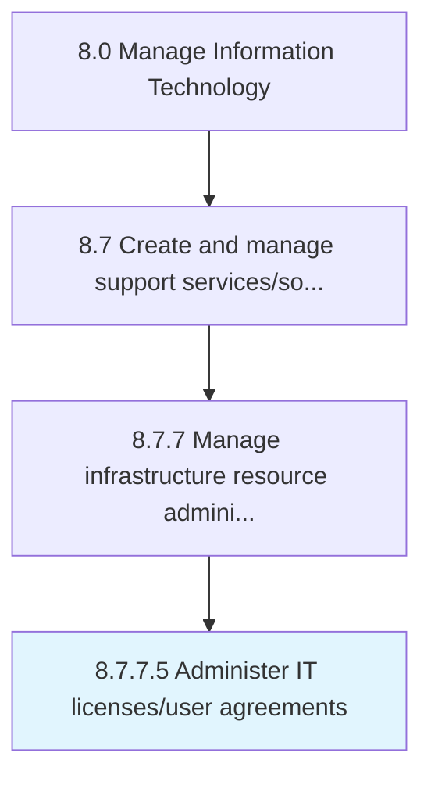

# Administer IT licenses/user agreements

> Administering and overseeing the terms and policies associated with licensing the IT intellectual property.

## Overview

Activity 8.7.7.5 is an activity within the Manage Information Technology framework. 

Administering and overseeing the terms and policies associated with licensing the IT intellectual property. Create and manage the policies and terms governing the possible granting of a license to any external agent. Demarcate a clear framework that governs the licensing of any patents or copyrights held by the organization.

## Process Hierarchy



## Key Statistics

| Metric | Value |
|--------|-------|
| APQC Code | 20919 |
| Hierarchy ID | 8.7.7.5 |
| Level | Activity |
| Parent | [8.7.7](../) |
| Sub-Processes | 0 |


## GraphDL Semantic Structure

```
administer.ITLicensesuserAgreements
```

| Component | Value | Description |
|-----------|-------|-------------|
| Verb | `administer` | Primary action |
| Object | `IT licenses/user agreements` | Direct object |


## Related Concepts

- ITLicensesAgreements
- ITUserAgreements


---

*Source: APQC PCF 20919 (8.7.7.5) - APQC*
