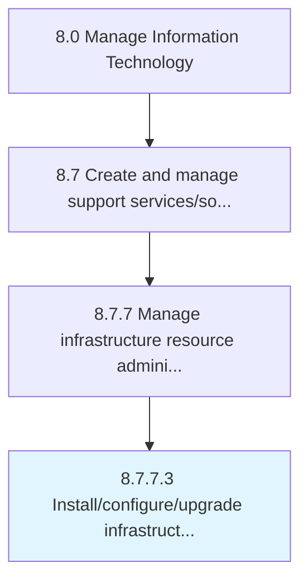

# Install/configure/upgrade infrastructure components

> Installing/configuring/upgrading all the components required for operational activities within IT infrastructure.

## Overview

Activity 8.7.7.3 is an activity within the Manage Information Technology framework. 

Installing/configuring/upgrading all the components required for operational activities within IT infrastructure. Ensure that all components of an IT infrastructure are functioning properly and updated to latest version/technology.

## Process Hierarchy



## Key Statistics

| Metric | Value |
|--------|-------|
| APQC Code | 20917 |
| Hierarchy ID | 8.7.7.3 |
| Level | Activity |
| Parent | [8.7.7](../) |
| Sub-Processes | 0 |


## GraphDL Semantic Structure

```
install/configure/upgrade.InfrastructureComponents
```

| Component | Value | Description |
|-----------|-------|-------------|
| Verb | `install/configure/upgrade` | Primary action |
| Object | `infrastructure components` | Direct object |


## Related Concepts

- /Configure/UpgradeInfrastructureComponents


---

*Source: APQC PCF 20917 (8.7.7.3) - APQC*
