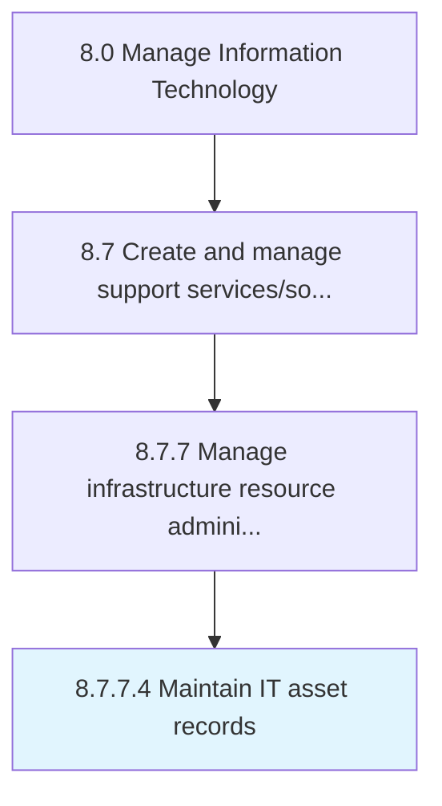

# Maintain IT asset records

> Maintaining the complete list of IT items or resources available with the organization with the details on date of purchase, licenses, deployment and SLAs.

## Overview

Activity 8.7.7.4 is an activity within the Manage Information Technology framework. 

Maintaining the complete list of IT items or resources available with the organization with the details on date of purchase, licenses, deployment and SLAs.

## Process Hierarchy



## Key Statistics

| Metric | Value |
|--------|-------|
| APQC Code | 20918 |
| Hierarchy ID | 8.7.7.4 |
| Level | Activity |
| Parent | [8.7.7](../) |
| Sub-Processes | 0 |


## GraphDL Semantic Structure

```
maintain.ITAssetRecords
```

| Component | Value | Description |
|-----------|-------|-------------|
| Verb | `maintain` | Primary action |
| Object | `IT asset records` | Direct object |


## Related Concepts

- [ITAssetRecords](/concepts/ITAssetRecords)


---

*Source: APQC PCF 20918 (8.7.7.4) - APQC*
