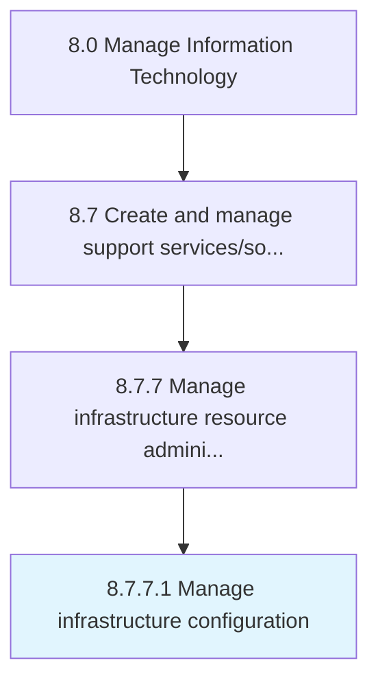

# Manage infrastructure configuration

> Identifying and tracking individual configuration items, documenting functional capabilities and interdependencies of IT infrastructure.

## Overview

Activity 8.7.7.1 is an activity within the Manage Information Technology framework. 

Identifying and tracking individual configuration items, documenting functional capabilities and interdependencies of IT infrastructure. Determining the gaps and needs in order to enhance existing infrastructure configuration.

## Process Hierarchy



## Key Statistics

| Metric | Value |
|--------|-------|
| APQC Code | 20915 |
| Hierarchy ID | 8.7.7.1 |
| Level | Activity |
| Parent | [8.7.7](../) |
| Sub-Processes | 0 |


## GraphDL Semantic Structure

```
manage.InfrastructureConfiguration
```

| Component | Value | Description |
|-----------|-------|-------------|
| Verb | `manage` | Primary action |
| Object | `infrastructure configuration` | Direct object |


## Related Concepts

- [InfrastructureConfiguration](/concepts/InfrastructureConfiguration)


---

*Source: APQC PCF 20915 (8.7.7.1) - APQC*
