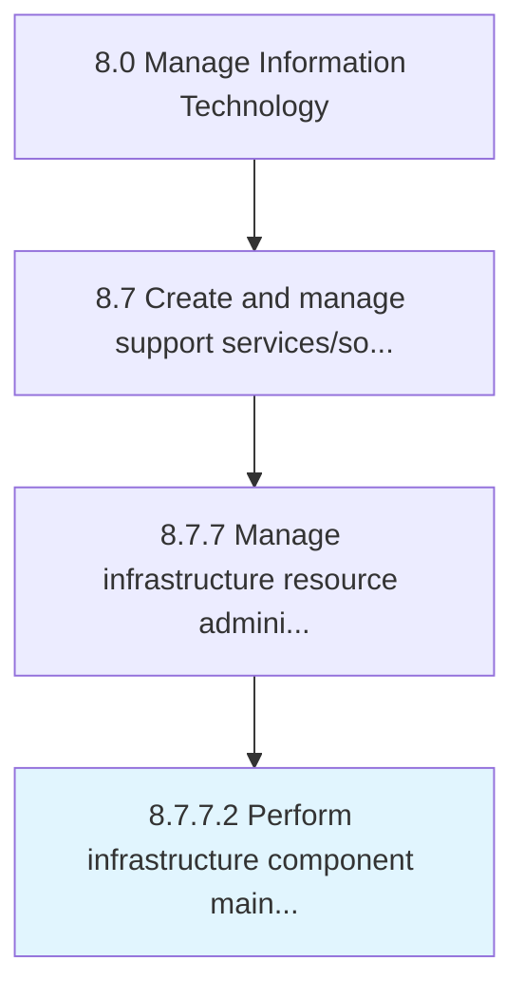

# Perform infrastructure component maintenance

> Evaluating and maintaining all aspects of infrastructure component maintenance.

## Overview

Activity 8.7.7.2 is an activity within the Manage Information Technology framework. 

Evaluating and maintaining all aspects of infrastructure component maintenance. Ensure that all components of an IT infrastructure are functioning properly as per the expectation. Maintenance includes all preventative, routine, and corrective measures.

## Process Hierarchy



## Key Statistics

| Metric | Value |
|--------|-------|
| APQC Code | 20916 |
| Hierarchy ID | 8.7.7.2 |
| Level | Activity |
| Parent | [8.7.7](../) |
| Sub-Processes | 0 |


## GraphDL Semantic Structure

```
perform.InfrastructureComponentMaintenance
```

| Component | Value | Description |
|-----------|-------|-------------|
| Verb | `perform` | Primary action |
| Object | `infrastructure component maintenance` | Direct object |


## Related Concepts

- InfrastructureComponentMaintenance


---

*Source: APQC PCF 20916 (8.7.7.2) - APQC*
