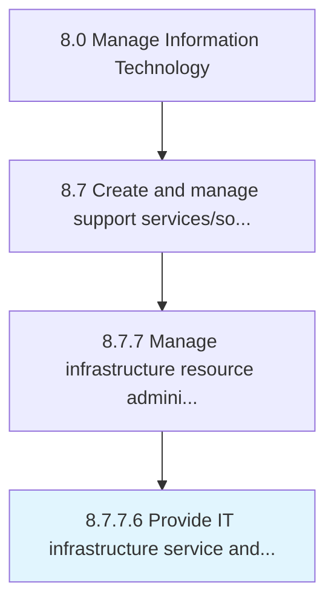

# Provide IT infrastructure service and capabilities

> Providing all the infrastructure services and capabilities required for operational activities within the IT function supporting overall business objectives.

## Overview

Activity 8.7.7.6 is an activity within the Manage Information Technology framework. 

Providing all the infrastructure services and capabilities required for operational activities within the IT function supporting overall business objectives.

## Process Hierarchy



## Key Statistics

| Metric | Value |
|--------|-------|
| APQC Code | 20920 |
| Hierarchy ID | 8.7.7.6 |
| Level | Activity |
| Parent | [8.7.7](../) |
| Sub-Processes | 0 |


## GraphDL Semantic Structure

```
provide.ITInfrastructureServiceAndCapabilities
```

| Component | Value | Description |
|-----------|-------|-------------|
| Verb | `provide` | Primary action |
| Object | `IT infrastructure service and capabilities` | Direct object |


## Related Concepts

- ITInfrastructureService
- Capabilities


---

*Source: APQC PCF 20920 (8.7.7.6) - APQC*
