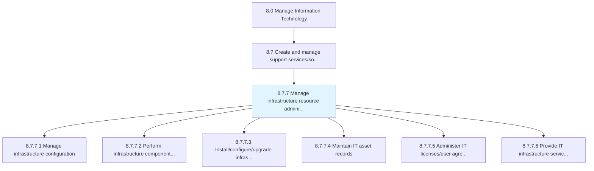
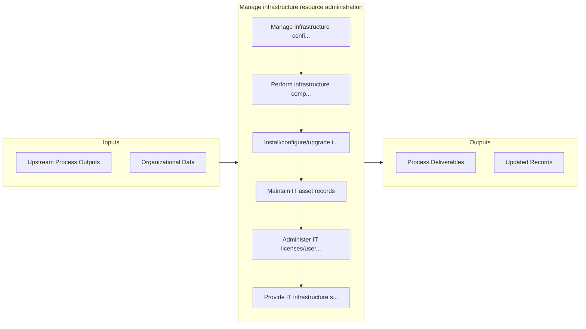

# Manage infrastructure resource administration

> Managing the resources required for administration of IT infrastructure.

## Overview

Process 8.7.7 is a core process that defines the specific procedures for manage infrastructure resource administration. 

Managing the resources required for administration of IT infrastructure. Manage the IT inventory and assets. Take care of the organization's IT resource capacity.

## Process Hierarchy



## Key Statistics

| Metric | Value |
|--------|-------|
| APQC Code | 20914 |
| Hierarchy ID | 8.7.7 |
| Level | Process |
| Parent | [8.7](../) |
| Sub-Processes | 6 |


## GraphDL Semantic Structure

```graphdl
manage.InfrastructureResourceAdministration
```

| Component | Value | Description |
|-----------|-------|-------------|
| Verb | `manage` | Primary action |
| Object | `infrastructure resource administration` | Direct object |


## Process Flow



## Sub-Processes

| Process | Hierarchy ID | Description |
|---------|-------------|-------------|
| [Manage infrastructure configuration](./ManageInfrastructureConfiguration) | 8.7.7.1 | Identifying and tracking individual configuration items, documenting functional capabilities and int |
| [Perform infrastructure component maintenance](./PerformInfrastructureComponentMaintenance) | 8.7.7.2 | Evaluating and maintaining all aspects of infrastructure component maintenance |
| [Install/configure/upgrade infrastructure components](./InstallconfigureupgradeInfrastructureComponents) | 8.7.7.3 | Installing/configuring/upgrading all the components required for operational activities within IT in |
| [Maintain IT asset records](./MaintainITAssetRecords) | 8.7.7.4 | Maintaining the complete list of IT items or resources available with the organization with the deta |
| [Administer IT licenses/user agreements](./AdministerITLicensesuserAgreements) | 8.7.7.5 | Administering and overseeing the terms and policies associated with licensing the IT intellectual pr |
| [Provide IT infrastructure service and capabilities](./ProvideITInfrastructureServiceAndCapabilities) | 8.7.7.6 | Providing all the infrastructure services and capabilities required for operational activities withi |


## Related Concepts

- InfrastructureResourceAdministration


---

*Source: APQC PCF 20914 (8.7.7) - APQC*
