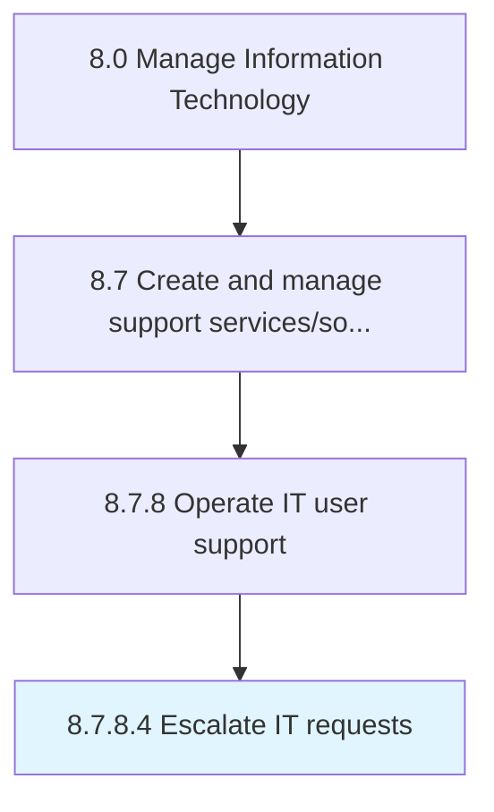

# Escalate IT requests

> Follow processes and procedures to escalate IT requests to required levels for resolution or effective decision making when necessary.

## Overview

Activity 8.7.8.4 is an activity within the Manage Information Technology framework. 

Follow processes and procedures to escalate IT requests to required levels for resolution or effective decision making when necessary.

## Process Hierarchy



## Key Statistics

| Metric | Value |
|--------|-------|
| APQC Code | 20926 |
| Hierarchy ID | 8.7.8.4 |
| Level | Activity |
| Parent | [8.7.8](../) |
| Sub-Processes | 0 |


## GraphDL Semantic Structure

```
escalate.ITRequests
```

| Component | Value | Description |
|-----------|-------|-------------|
| Verb | `escalate` | Primary action |
| Object | `IT requests` | Direct object |


## Related Concepts

- [ITRequests](/concepts/ITRequests)


---

*Source: APQC PCF 20926 (8.7.8.4) - APQC*
