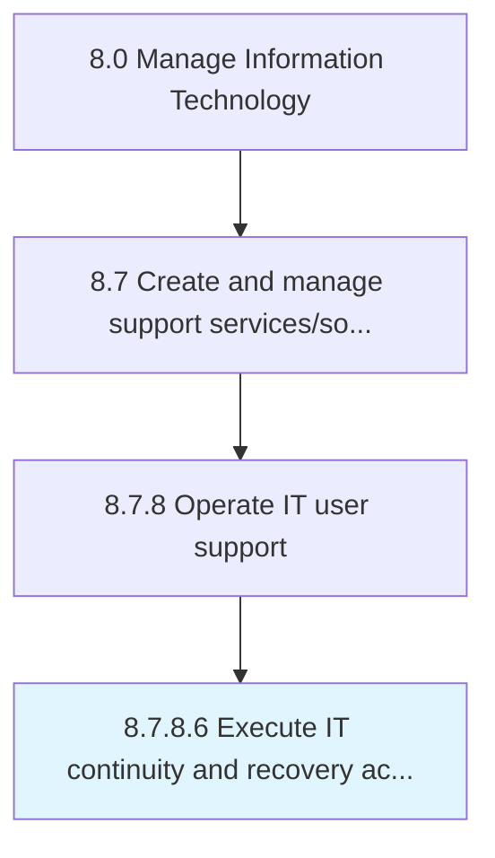

# Execute IT continuity and recovery action

> Successfully implement preventive measures to manage IT risk of exposure to internal and external threats.

## Overview

Activity 8.7.8.6 is an activity within the Manage Information Technology framework. 

Successfully implement preventive measures to manage IT risk of exposure to internal and external threats. Integrating the disciplines of Emergency Response, Crisis Management, Disaster Recovery (technology continuity) and Business Continuity for IT.

## Process Hierarchy



## Key Statistics

| Metric | Value |
|--------|-------|
| APQC Code | 20928 |
| Hierarchy ID | 8.7.8.6 |
| Level | Activity |
| Parent | [8.7.8](../) |
| Sub-Processes | 0 |


## GraphDL Semantic Structure

```
execute.ITContinuityAndRecoveryAction
```

| Component | Value | Description |
|-----------|-------|-------------|
| Verb | `execute` | Primary action |
| Object | `IT continuity and recovery action` | Direct object |


## Related Concepts

- ITContinuityAction
- RecoveryAction


---

*Source: APQC PCF 20928 (8.7.8.6) - APQC*
