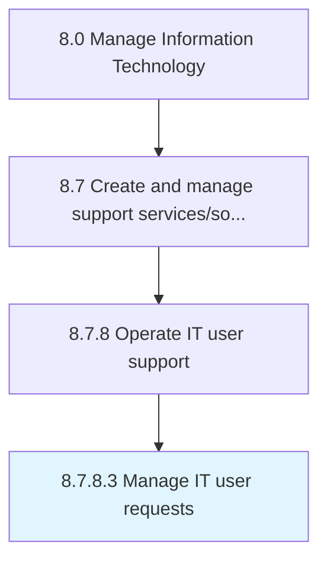

# Manage IT user requests

> Creating an effective plan and structure to address and resolve requests of IT users.

## Overview

Activity 8.7.8.3 is an activity within the Manage Information Technology framework. 

Creating an effective plan and structure to address and resolve requests of IT users. Determine, record, and monitor user requests. Obtain information about the effectiveness and performance of the user request handling process from the IT users through various means.

## Process Hierarchy



## Key Statistics

| Metric | Value |
|--------|-------|
| APQC Code | 20925 |
| Hierarchy ID | 8.7.8.3 |
| Level | Activity |
| Parent | [8.7.8](../) |
| Sub-Processes | 0 |


## GraphDL Semantic Structure

```
manage.ITUserRequests
```

| Component | Value | Description |
|-----------|-------|-------------|
| Verb | `manage` | Primary action |
| Object | `IT user requests` | Direct object |


## Related Concepts

- ITUserRequests


---

*Source: APQC PCF 20925 (8.7.8.3) - APQC*
