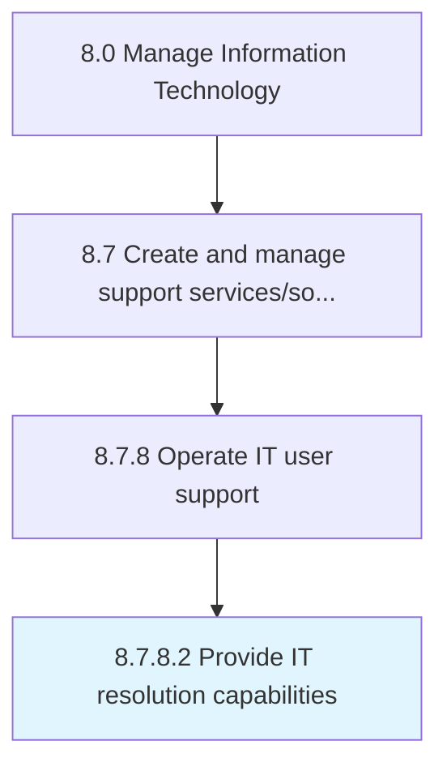

# Provide IT resolution capabilities

> Providing the necessary skills and competencies required to efficiently provide IT resolution through the support structure.

## Overview

Activity 8.7.8.2 is an activity within the Manage Information Technology framework. 

Providing the necessary skills and competencies required to efficiently provide IT resolution through the support structure.

## Process Hierarchy



## Key Statistics

| Metric | Value |
|--------|-------|
| APQC Code | 20923 |
| Hierarchy ID | 8.7.8.2 |
| Level | Activity |
| Parent | [8.7.8](../) |
| Sub-Processes | 0 |


## GraphDL Semantic Structure

```
provide.ITResolutionCapabilities
```

| Component | Value | Description |
|-----------|-------|-------------|
| Verb | `provide` | Primary action |
| Object | `IT resolution capabilities` | Direct object |


## Related Concepts

- ITResolutionCapabilities


---

*Source: APQC PCF 20923 (8.7.8.2) - APQC*
