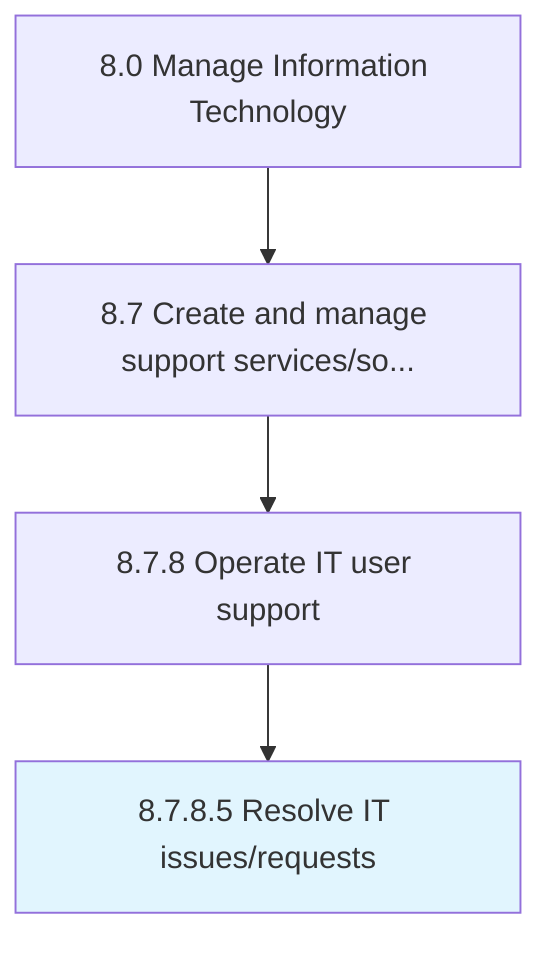

# Resolve IT issues/requests

> Creating a structure to resolve issues/requests of IT services using different mechanisms.

## Overview

Activity 8.7.8.5 is an activity within the Manage Information Technology framework. 

Creating a structure to resolve issues/requests of IT services using different mechanisms.

## Process Hierarchy



## Key Statistics

| Metric | Value |
|--------|-------|
| APQC Code | 20927 |
| Hierarchy ID | 8.7.8.5 |
| Level | Activity |
| Parent | [8.7.8](../) |
| Sub-Processes | 0 |


## GraphDL Semantic Structure

```
resolve.ITIssuesrequests
```

| Component | Value | Description |
|-----------|-------|-------------|
| Verb | `resolve` | Primary action |
| Object | `IT issues/requests` | Direct object |


## Related Concepts

- [ITIssues](/concepts/ITIssues)
- [ITRequests](/concepts/ITRequests)


---

*Source: APQC PCF 20927 (8.7.8.5) - APQC*
