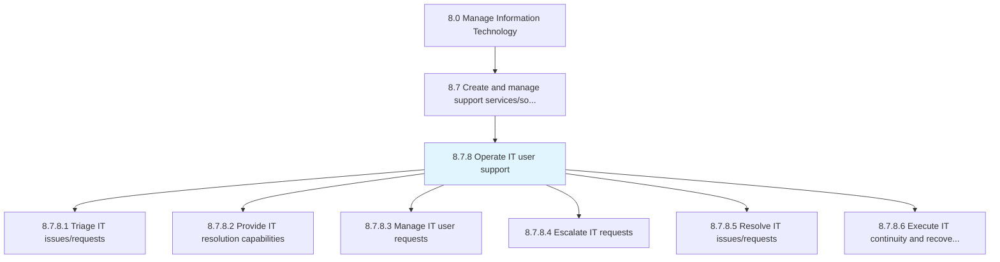
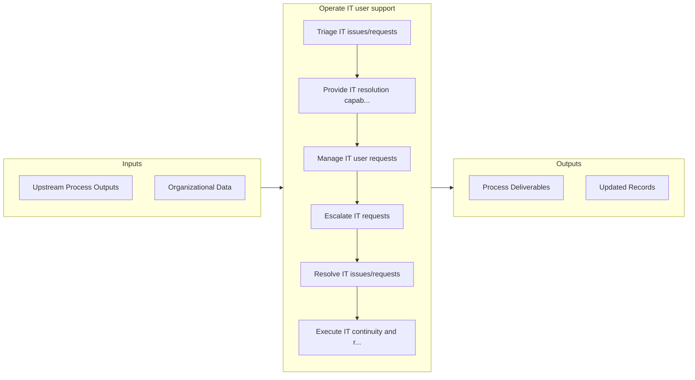

# Operate IT user support

> Managing systematic user support functionality and capability through defined procedures.

## Overview

Process 8.7.8 is a core process that defines the specific procedures for operate it user support. 

Managing systematic user support functionality and capability through defined procedures. Determine, record, and monitor user requests. Execute issue/request resolution. Utilize escalation path when needed. Resolve issue/request.

## Process Hierarchy



## Key Statistics

| Metric | Value |
|--------|-------|
| APQC Code | 20921 |
| Hierarchy ID | 8.7.8 |
| Level | Process |
| Parent | [8.7](../) |
| Sub-Processes | 6 |


## GraphDL Semantic Structure

```
operate.ITUserSupport
```

| Component | Value | Description |
|-----------|-------|-------------|
| Verb | `operate` | Primary action |
| Object | `IT user support` | Direct object |


## Process Flow



## Sub-Processes

| Process | Hierarchy ID | Description |
|---------|-------------|-------------|
| [Triage IT issues/requests](./TriageITIssuesrequests) | 8.7.8.1 | Evaluate and assign IT issues/requests accordingly to allow for the correct routing of IT issues to  |
| [Provide IT resolution capabilities](./ProvideITResolutionCapabilities) | 8.7.8.2 | Providing the necessary skills and competencies required to efficiently provide IT resolution throug |
| [Manage IT user requests](./ManageITUserRequests) | 8.7.8.3 | Creating an effective plan and structure to address and resolve requests of IT users |
| [Escalate IT requests](./EscalateITRequests) | 8.7.8.4 | Follow processes and procedures to escalate IT requests to required levels for resolution or effecti |
| [Resolve IT issues/requests](./ResolveITIssuesrequests) | 8.7.8.5 | Creating a structure to resolve issues/requests of IT services using different mechanisms |
| [Execute IT continuity and recovery action](./ExecuteITContinuityAndRecoveryAction) | 8.7.8.6 | Successfully implement preventive measures to manage IT risk of exposure to internal and external th |


## Related Concepts

- ITUserSupport


---

*Source: APQC PCF 20921 (8.7.8) - APQC*
