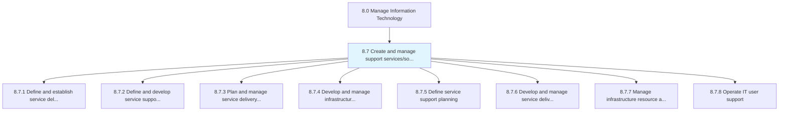
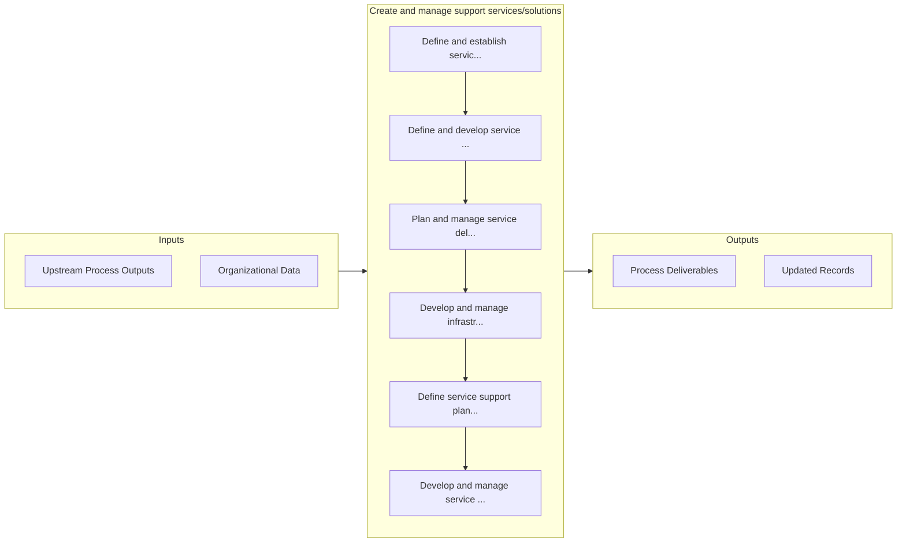

# Create and manage support services/solutions

> Establishing and managing services for providing support to users of IT services and solutions.

## Overview

Group 8.7 is a process group within APQC Category 8.0 (Manage Information Technology). 

Establishing and managing services for providing support to users of IT services and solutions. Define the plethora of services by which the organization assists users of computers, software products, or other information technology products.

## Process Hierarchy



## Key Statistics

| Metric | Value |
|--------|-------|
| APQC Code | 20866 |
| Hierarchy ID | 8.7 |
| Level | Group |
| Parent | [8](../) |
| Sub-Processes | 8 |


## GraphDL Semantic Structure

```
create.AndManageSupportServicessolutions
```

| Component | Value | Description |
|-----------|-------|-------------|
| Verb | `create` | Primary action |
| Object | `and manage support services/solutions` | Direct object |


## Process Flow



## Sub-Processes

| Process | Hierarchy ID | Description |
|---------|-------------|-------------|
| [Define and establish service delivery strategy](./8.7.1-DefineEstablishServiceDelivery/) | 8.7.1 | Defining and establishing strategy for delivering IT services and solutions to the users |
| [Define and develop service support strategy](./8.7.2-DefineDevelopServiceSupport/) | 8.7.2 | Defining and creating a strategy for provision of support to users of IT services and solutions |
| [Plan and manage service delivery control](./8.7.3-PlanManageServiceDelivery/) | 8.7.3 | Determine and manage service delivery flow across different business functions |
| [Develop and manage infrastructure resource planning](./8.7.4-DevelopManageInfrastructureResource/) | 8.7.4 | Developing and managing the resources required for administration of infrastructure |
| [Define service support planning](./8.7.5-DefineServiceSupportPlanning/) | 8.7.5 | Develop strategies and methodologies to provide service support |
| [Develop and manage service delivery operations](./8.7.6-DevelopManageServiceDelivery/) | 8.7.6 | Developing and managing different delivery services using service delivery systems for operational a |
| [Manage infrastructure resource administration](./8.7.7-ManageInfrastructureResourceAdministration/) | 8.7.7 | Managing the resources required for administration of IT infrastructure |
| [Operate IT user support](./8.7.8-OperateITUserSupport/) | 8.7.8 | Managing systematic user support functionality and capability through defined procedures |


## Related Concepts

- [SupportServices](/concepts/SupportServices)
- [SupportSolutions](/concepts/SupportSolutions)
- [SupportServices](/concepts/SupportServices)
- [SupportSolutions](/concepts/SupportSolutions)


---

*Source: APQC PCF 20866 (8.7) - APQC*
