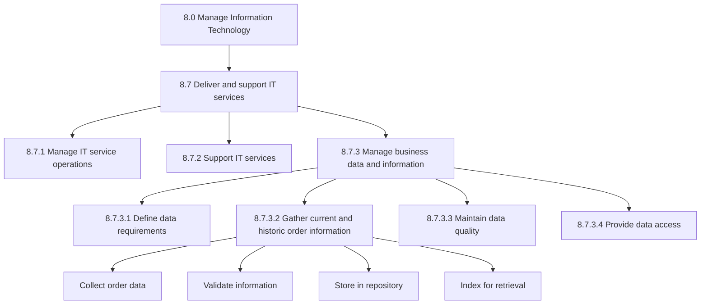
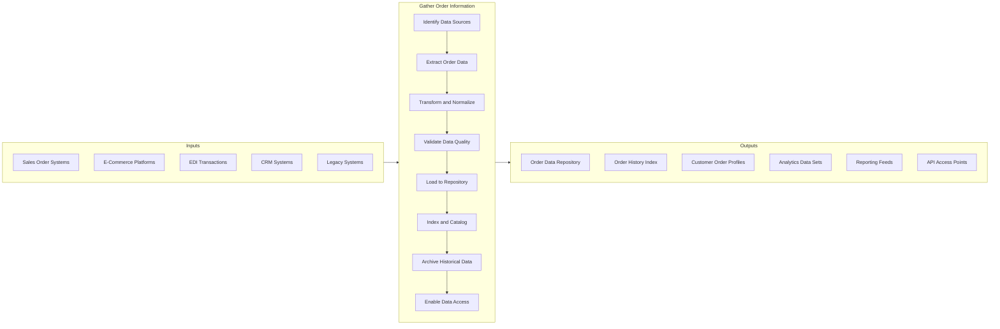
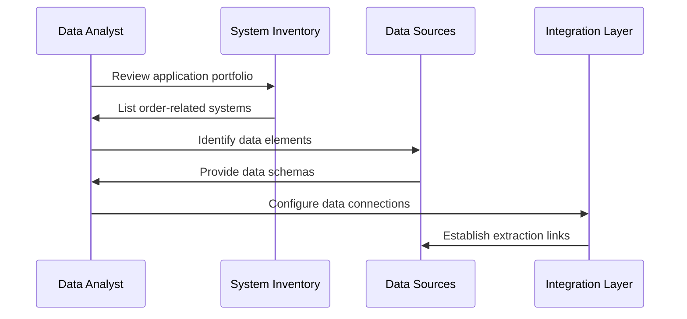
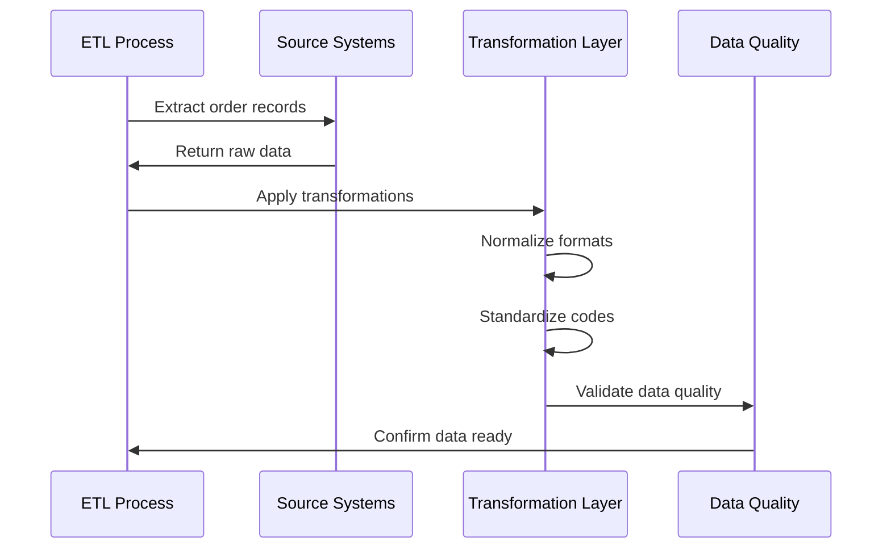
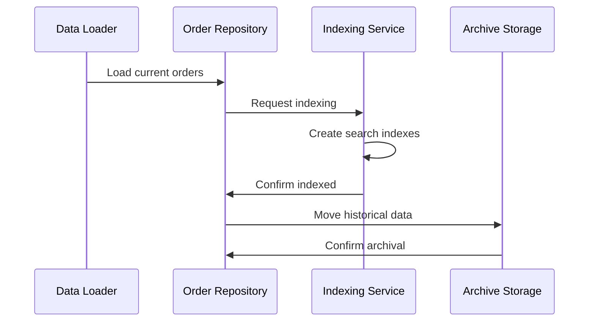
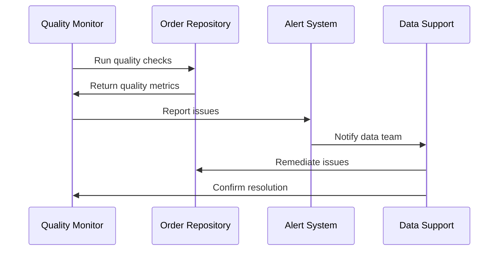
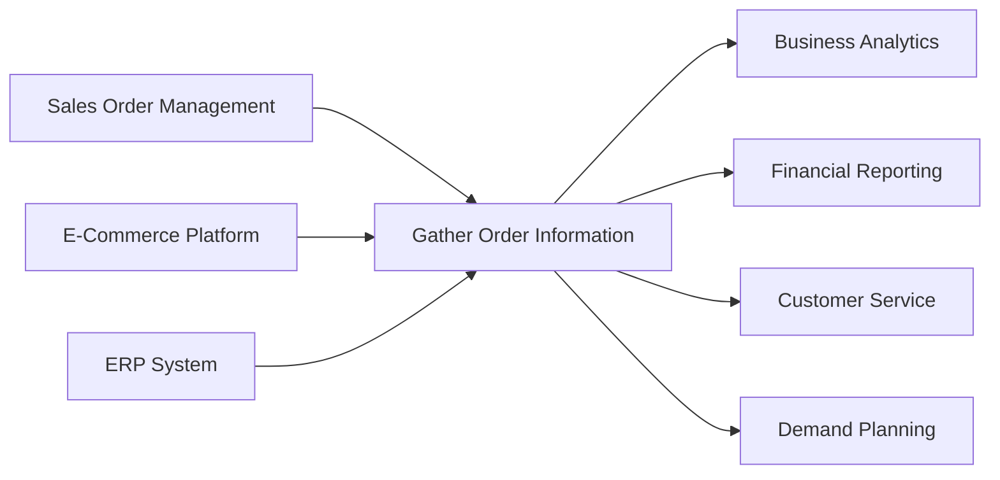

# Gather current and historic order information

> Gathering all information about sales orders into an index. Create a directory of all sales orders, whether open or those which have been fulfilled. Track what product/service was ordered, the quantity ordered, who ordered it, the delivery date, the shipping method, the unit price and line total, payment terms, and any discount applied.

## Overview

Gather current and historic order information is an IT service delivery process (APQC 10134) that supports business operations by collecting, organizing, and maintaining comprehensive order data. This process involves creating and managing a centralized repository of all order-related information that enables business analytics, customer service, and operational decision-making.

Organizations rely on accurate and accessible order information for demand planning, customer relationship management, financial reporting, and supply chain optimization. This process ensures that IT systems capture, store, and make available all relevant order data in a timely and reliable manner.

## Process Hierarchy



## Key Statistics

| Metric | Value |
|--------|-------|
| APQC Code | 10134 |
| Hierarchy ID | 8.7.3.2 |
| Level | Activity |
| Category | [Manage Information Technology](/processes/08-IT) |
| Process Group | Deliver and support IT services |
| Parent Process | Manage business data and information |

## Process Flow



## GraphDL Semantic Structure

```
gather.OrderInformation.from.CurrentAndHistoricSources
```

| Component | Value | Description |
|-----------|-------|-------------|
| Verb | `gather` | Primary action of collecting and aggregating |
| Object | `OrderInformation` | Sales orders, fulfillment data, customer details |
| Preposition | `from` | Source relationship |
| PrepObject | `CurrentAndHistoricSources` | Active and archived order systems |

## Activities

### 8.7.3.2.1 - Identify and connect to order data sources

Mapping all systems that contain order information and establishing data extraction connections.



**Tasks:**
- `inventory.OrderSystems` - Catalog all systems containing order data
- `map.DataElements` - Identify relevant fields across systems
- `document.DataSchemas` - Record structure of source data
- `establish.Connections` - Create data extraction pipelines

### 8.7.3.2.2 - Extract and transform order data

Pulling order data from source systems and transforming it into a consistent format for storage and analysis.



**Tasks:**
- `extract.OrderRecords` - Pull data from source systems
- `transform.DataFormats` - Convert to standard structure
- `normalize.Codes` - Standardize product, customer, status codes
- `enrich.OrderData` - Add derived fields and lookups

### 8.7.3.2.3 - Load and index order information

Storing transformed order data in the central repository and creating indexes for efficient retrieval.



**Tasks:**
- `load.ToRepository` - Insert data into central store
- `create.SearchIndexes` - Build indexes for fast retrieval
- `partition.ByDate` - Organize data by time periods
- `archive.HistoricalData` - Move aged data to archive storage

### 8.7.3.2.4 - Maintain data quality and accessibility

Ensuring ongoing data accuracy, completeness, and availability for business users.



**Tasks:**
- `monitor.DataQuality` - Track accuracy and completeness metrics
- `detect.Anomalies` - Identify data quality issues
- `remediate.Issues` - Correct data problems
- `report.DataHealth` - Publish data quality dashboards

## RACI Matrix

| Activity | Responsible | Accountable | Consulted | Informed |
|----------|-------------|-------------|-----------|----------|
| Identify data sources | Data Engineer | Data Architect | Application Owners | Business Analysts |
| Extract order data | ETL Developer | Data Engineering Lead | Source System Admins | IT Operations |
| Transform and validate | Data Engineer | Data Quality Lead | Business SMEs | Data Governance |
| Load to repository | Database Admin | Data Platform Lead | Data Engineers | Users |
| Create indexes | Database Admin | Data Architect | Performance Team | Data Consumers |
| Maintain quality | Data Steward | Data Governance Lead | Business Users | IT Management |

## Related Departments

- [Information Technology](/departments/IT) - Primary ownership and execution
- [Sales Operations](/departments/SalesOps) - Order data source and consumer
- [Finance](/departments/Finance) - Revenue reporting consumer
- [Supply Chain](/departments/SupplyChain) - Fulfillment data consumer
- [Customer Service](/departments/CustomerService) - Order inquiry support

## Related Occupations

- [Database Administrators](/occupations/DatabaseAdministrators) - Data storage management
- [Data Engineers](/occupations/DataEngineers) - ETL development
- [Business Intelligence Analysts](/occupations/BIAnalysts) - Data analysis and reporting
- [Data Quality Analysts](/occupations/DataQualityAnalysts) - Data quality monitoring
- [Systems Analysts](/occupations/SystemsAnalysts) - Integration design

## Industry Variations

### Banking

Banking order information encompasses transaction records, trade orders, and service requests. Data must comply with regulatory retention requirements and support audit trails for compliance reporting.

**Industry-Specific Activities:**
- Gather trade order and execution data for compliance
- Collect wire transfer and payment transaction records
- Maintain account service request history
- Archive regulatory-required transaction records

### Healthcare Provider

Healthcare order information includes clinical orders, lab requisitions, pharmacy orders, and supply chain orders. HIPAA compliance and patient data protection are critical considerations.

**Industry-Specific Activities:**
- Collect physician order entry (CPOE) records
- Gather pharmacy dispensing and medication orders
- Maintain lab and diagnostic order history
- Archive patient billing and charge records

### Retail

Retail order information spans e-commerce, POS transactions, wholesale orders, and returns. Real-time availability for customer service and inventory management is essential.

**Industry-Specific Activities:**
- Gather omnichannel order data from all sales channels
- Collect point-of-sale transaction records
- Maintain return and exchange history
- Archive promotional and discount data

### Aerospace and Defense

Aerospace order information includes complex contract orders, engineering change orders, and spare parts orders. Long retention periods and audit requirements for government contracts apply.

**Industry-Specific Activities:**
- Gather government contract order records
- Collect engineering change order history
- Maintain spare parts and MRO order data
- Archive bid and proposal information

### Consumer Products

Consumer products order information includes distributor orders, retail replenishment, and direct-to-consumer orders. Trade promotion and pricing data integration is important.

**Industry-Specific Activities:**
- Gather distributor and retailer order data
- Collect trade promotion order records
- Maintain category management order history
- Archive promotional pricing and discount data

## Sub-Processes

| Process | Code | Description |
|---------|------|-------------|
| [Define data requirements](./DataRequirements) | 8.7.3.1 | Specify order data needs |
| [Maintain data quality](./DataQuality) | 8.7.3.3 | Ensure data accuracy |
| [Provide data access](./DataAccess) | 8.7.3.4 | Enable data consumption |

## Related Processes



## Metrics & KPIs

| Metric | Description | Target |
|--------|-------------|--------|
| Data Freshness | Time lag from order creation to repository availability | <15 minutes |
| Data Completeness | Percentage of orders captured from all sources | >99.9% |
| Data Accuracy | Percentage of records matching source systems | >99.5% |
| Query Performance | Average response time for order lookups | <2 seconds |
| Archive Compliance | Percentage of data retained per policy | 100% |

---

*Source: APQC PCF 10134 (8.7.3.2) - Cross-Industry*
