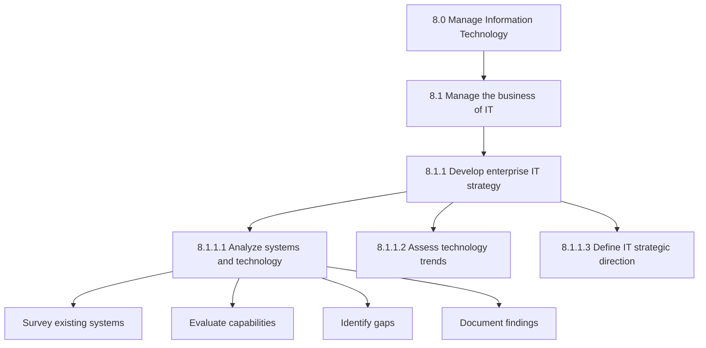
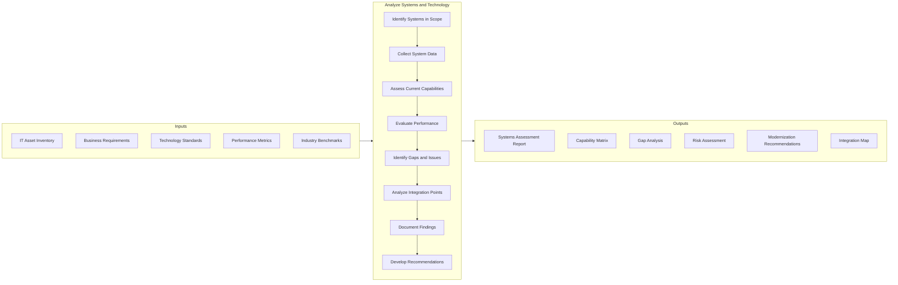
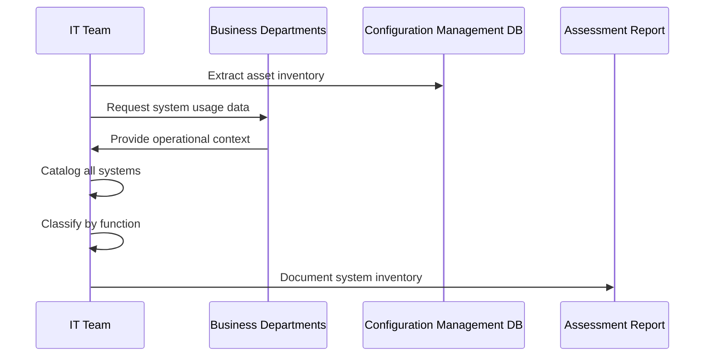
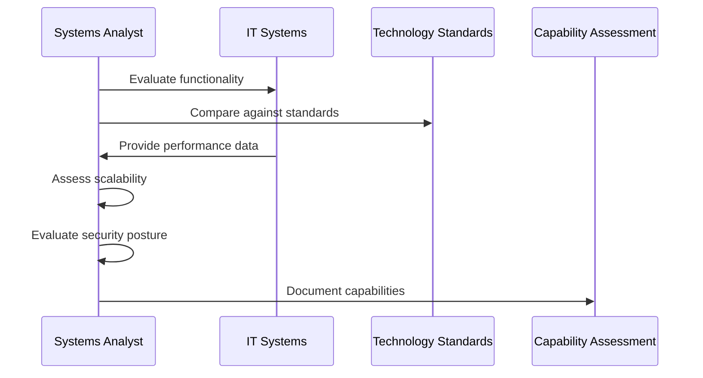
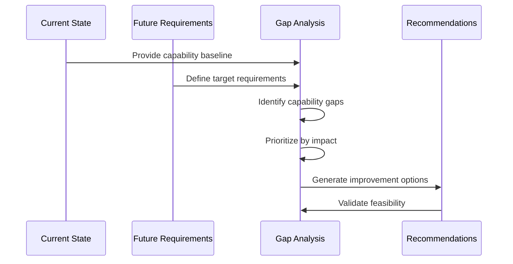
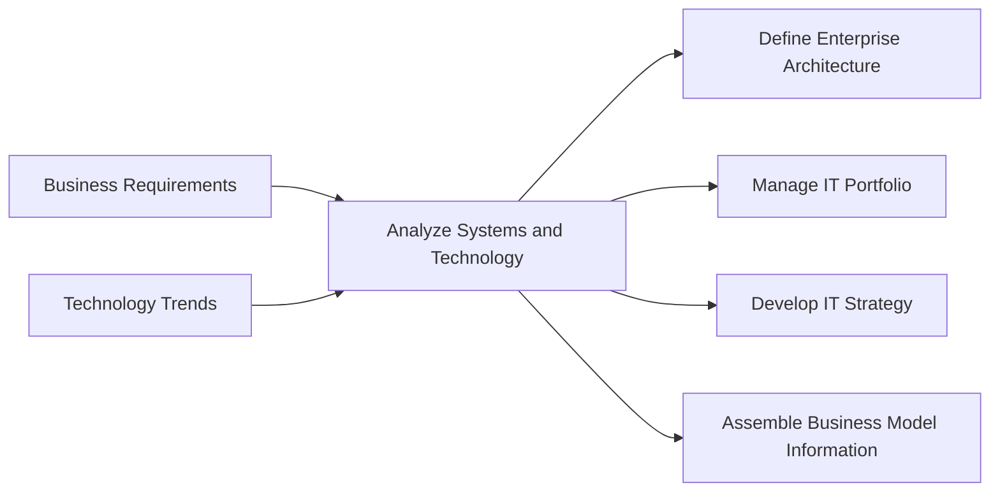

# Analyze systems and technology

> Analyzing the capabilities of technology and process automation systems deployed within the organization in order to direct future associated processes. Conduct a broad-based survey to examine various information technologies, communication infrastructures, and applications to determine current state, opportunities for improvement, and alignment with business objectives.

## Overview

Analyze systems and technology is a foundational IT management process (APQC 8.1.1.1) that evaluates the organization's existing technology landscape to inform strategic IT decisions. This process involves comprehensive assessment of hardware, software, networks, and automation systems to understand their current capabilities, limitations, and potential for improvement.

Organizations conduct systems analysis to identify gaps between current IT capabilities and business requirements, discover opportunities for consolidation or modernization, and build a fact-based foundation for IT investment decisions. The output of this process directly informs IT strategy development, architecture decisions, and portfolio management activities.

## Process Hierarchy



## Key Statistics

| Metric | Value |
|--------|-------|
| APQC Code | 10032 |
| Hierarchy ID | 8.1.1.1 |
| Level | Activity |
| Category | [Manage Information Technology](/processes/08-IT) |
| Process Group | Manage the business of IT |
| Parent Process | Develop enterprise IT strategy |

## Process Flow



## GraphDL Semantic Structure

```
analyze.SystemsAndTechnology.for.StrategicPlanning
```

| Component | Value | Description |
|-----------|-------|-------------|
| Verb | `analyze` | Primary action of examining and evaluating |
| Object | `SystemsAndTechnology` | IT systems, applications, and infrastructure |
| Preposition | `for` | Purpose relationship |
| PrepObject | `StrategicPlanning` | Informing IT strategy decisions |

## Activities

### 8.1.1.1.1 - Survey existing IT systems

Conducting a comprehensive inventory and assessment of all IT systems currently in use across the organization.



**Tasks:**
- `identify.ITSystems` - Create comprehensive inventory of all IT systems
- `classify.SystemsByFunction` - Categorize systems by business function
- `document.SystemDependencies` - Map interdependencies between systems
- `assess.SystemUsage` - Evaluate actual usage patterns and adoption rates

### 8.1.1.1.2 - Evaluate technology capabilities

Assessing the functional and technical capabilities of existing systems against current and future business requirements.



**Tasks:**
- `evaluate.FunctionalCapabilities` - Assess what each system can do
- `assess.TechnicalCapabilities` - Review technical specifications and limits
- `measure.PerformanceMetrics` - Collect and analyze performance data
- `compare.AgainstStandards` - Benchmark against industry standards

### 8.1.1.1.3 - Identify gaps and improvement opportunities

Analyzing the difference between current capabilities and desired future state to identify areas for improvement.



**Tasks:**
- `identify.CapabilityGaps` - Determine where systems fall short
- `assess.TechnologyDebt` - Evaluate accumulated technical debt
- `prioritize.ImprovementAreas` - Rank gaps by business impact
- `develop.ModernizationOptions` - Create options for addressing gaps

## RACI Matrix

| Activity | Responsible | Accountable | Consulted | Informed |
|----------|-------------|-------------|-----------|----------|
| Survey existing systems | Enterprise Architect | CIO | Business Unit Heads | IT Staff |
| Evaluate capabilities | Systems Analyst | IT Director | Application Owners | Business Stakeholders |
| Identify gaps | Enterprise Architect | CTO | Business Analysts | Executive Team |
| Assess performance | IT Operations | IT Director | System Administrators | Users |
| Document findings | Technical Writer | Enterprise Architect | IT Leadership | All Stakeholders |
| Develop recommendations | Enterprise Architect | CIO | Finance, Business Units | Board |

## Related Departments

- [Information Technology](/departments/IT) - Primary ownership and execution
- [Enterprise Architecture](/departments/EnterpriseArchitecture) - Strategic oversight
- [Operations](/departments/Operations) - Business process context
- [Finance](/departments/Finance) - Investment planning input
- [Security](/departments/Security) - Security assessment collaboration

## Related Occupations

- [Computer and Information Systems Managers](/occupations/ComputerInformationSystemsManagers) - Process oversight
- [Computer Systems Analysts](/occupations/ComputerSystemsAnalysts) - Primary executors
- [Database Administrators](/occupations/DatabaseAdministrators) - Database system analysis
- [Network and Computer Systems Administrators](/occupations/NetworkAdministrators) - Infrastructure analysis
- [Software Developers](/occupations/SoftwareDevelopers) - Application assessment

## Industry Variations

### Banking

Banking systems analysis requires special attention to core banking platforms, payment processing systems, and regulatory reporting capabilities. Assessment must consider real-time transaction processing requirements and compliance with financial regulations.

**Industry-Specific Activities:**
- Assess core banking system capabilities and vendor roadmaps
- Evaluate payment gateway integration and PCI-DSS compliance
- Analyze fraud detection and AML system effectiveness
- Review regulatory reporting system accuracy and timeliness

### Healthcare Provider

Healthcare systems analysis focuses on clinical systems, EHR platforms, and medical device integration. HIPAA compliance and interoperability standards (HL7, FHIR) are critical assessment criteria.

**Industry-Specific Activities:**
- Evaluate EHR system usability and clinical workflow support
- Assess medical device integration and IoMT security
- Analyze clinical decision support system effectiveness
- Review patient portal and telehealth capabilities

### Retail

Retail systems analysis emphasizes omnichannel commerce platforms, inventory management, and customer-facing systems. Real-time inventory visibility and seamless customer experience across channels are key focus areas.

**Industry-Specific Activities:**
- Assess POS system capabilities and payment integration
- Evaluate e-commerce platform scalability and performance
- Analyze inventory management system accuracy
- Review customer data platform and personalization capabilities

### Aerospace and Defense

Aerospace and defense systems analysis requires attention to classified system handling, long lifecycle support requirements, and engineering design systems. Compliance with ITAR, NIST, and DoD standards is essential.

**Industry-Specific Activities:**
- Evaluate PLM and engineering design system capabilities
- Assess classified system security and compartmentalization
- Analyze supply chain system integration with prime contractors
- Review simulation and testing system capabilities

## Sub-Processes

| Process | Code | Description |
|---------|------|-------------|
| [Assess technology trends](./TechTrends) | 8.1.1.2 | Evaluate emerging technologies |
| [Define IT strategic direction](./ITDirection) | 8.1.1.3 | Set IT strategy based on analysis |
| [Identify technology implications](./TechImplications.mdx) | 13290 | Determine ROI and architecture impacts |

## Related Processes



## Metrics & KPIs

| Metric | Description | Target |
|--------|-------------|--------|
| Assessment Coverage | Percentage of IT systems assessed annually | 100% |
| Gap Identification Rate | Number of critical gaps identified per assessment | Track trend |
| Recommendation Adoption | Percentage of recommendations implemented | >70% |
| Assessment Cycle Time | Time to complete comprehensive assessment | <90 days |
| Stakeholder Satisfaction | Satisfaction with assessment quality and usefulness | >85% |

---

*Source: APQC PCF 10032 (8.1.1.1) - Cross-Industry*
