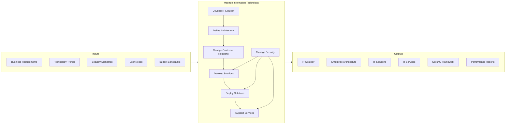
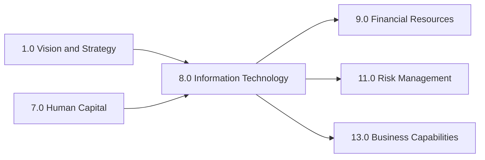

# Manage Information Technology

> Managing the business of information technology across the organization. This involves developing IT strategy and architecture, managing IT customer relationships, developing and maintaining solutions, deploying IT services, and ensuring security, privacy, and data protection.

## Overview

APQC Category 8.0 - Manage Information Technology encompasses all processes related to the governance, development, delivery, and support of IT services and solutions within an organization. This category provides the technological foundation that enables all other business processes to operate efficiently and securely.

Modern organizations depend heavily on IT for competitive advantage, operational efficiency, and innovation. The processes within this category ensure that IT investments are strategically aligned with business objectives, that systems are reliable and secure, and that technology enables rather than hinders business performance.

## Process Hierarchy

```mermaid
graph TD
    C8["8.0 Manage Information Technology"] --> G81["8.1 Manage the business of IT"]
    C8 --> G82["8.2 Develop and manage IT<br/>customer relationships"]
    C8 --> G83["8.3 Develop and manage<br/>IT business strategy"]
    C8 --> G84["8.4 Develop and manage IT<br/>resilience and risk"]
    C8 --> G85["8.5 Develop and manage<br/>solutions"]
    C8 --> G86["8.6 Deploy IT solutions"]
    C8 --> G87["8.7 Deliver and support<br/>IT services"]

    G81 --> P811["8.1.1 Develop enterprise IT strategy"]
    G81 --> P812["8.1.2 Define enterprise architecture"]
    G81 --> P813["8.1.3 Manage IT portfolio"]

    G82 --> P821["8.2.1 Understand IT customer needs"]
    G82 --> P822["8.2.2 Plan IT services"]
    G82 --> P823["8.2.3 Manage IT service levels"]

    G83 --> P831["8.3.1 Manage IT value portfolio"]
    G83 --> P832["8.3.2 Research and innovate"]
    G83 --> P833["8.3.3 Assess IT performance"]

    G84 --> P841["8.4.1 Develop IT compliance"]
    G84 --> P842["8.4.2 Manage IT risk"]
    G84 --> P843["8.4.3 Manage IT security"]
```

## Key Statistics

| Metric | Value |
|--------|-------|
| APQC Code | 8.0 |
| Hierarchy ID | 8.0 |
| Level | Category |
| Process Groups | 7 |
| Total Processes | 150+ |

## Process Flow

## Processes in this Category

### 8.1 Manage the business of IT

Managing the core functions of IT including strategy development, architecture definition, and portfolio management.

- [Analyze systems and technology](./SystemsAnalysis.mdx) - Process for analyzing technology capabilities
- [Identify implications for key technology aspects](./TechImplications.mdx) - Process for determining technology ROI and architecture implications

### 8.2 Develop and manage IT customer relationships

Creating and administering relationships with IT customers, understanding their needs, and establishing service levels.

- [Communicate planning information to customer teams](./PlanningComms.mdx) - Process for IT communication with stakeholders

### 8.3 Develop and manage IT business strategy

Handling the strategic business of IT, including value portfolio management and innovation.

- [Assemble business model information](./BusinessModel.mdx) - Process for collecting business model materials

### 8.4 Develop and manage IT resilience and risk

Developing processes to adapt and respond to disruptions, managing risk and compliance.

### 8.5 Develop and manage solutions

Creating and maintaining IT solutions that meet business requirements.

### 8.6 Deploy IT solutions

Implementing and rolling out IT solutions across the organization.

### 8.7 Deliver and support IT services

Providing ongoing IT service delivery and support operations.

- [Gather current and historic order information](./OrderInformation.mdx) - Process for managing order data

## Related Categories

## Industry Variations

### Banking

Banking institutions require heightened focus on regulatory compliance (SOX, PCI-DSS), real-time transaction processing, and cybersecurity. IT must support omnichannel banking experiences while maintaining strict data privacy standards.

**Industry-Specific Activities:**
- Manage core banking system integration
- Implement fraud detection systems
- Ensure regulatory reporting compliance

### Healthcare Provider

Healthcare IT emphasizes HIPAA compliance, electronic health records (EHR) systems, and interoperability between clinical systems. Security and patient data privacy are paramount concerns.

**Industry-Specific Activities:**
- Manage EHR system implementations
- Ensure HL7/FHIR interoperability
- Implement clinical decision support systems

### Retail

Retail IT focuses on omnichannel commerce platforms, inventory management systems, and customer experience technologies. Point-of-sale systems and e-commerce integration are critical.

**Industry-Specific Activities:**
- Manage e-commerce platform operations
- Integrate POS and inventory systems
- Support customer analytics platforms

### Aerospace and Defense

Aerospace and defense require compliance with government security standards (ITAR, NIST), long development cycles, and mission-critical system reliability. Configuration management and documentation are extensive.

**Industry-Specific Activities:**
- Maintain classified system security
- Manage configuration control
- Support engineering design systems

---

*Source: APQC PCF Category 8.0 - Cross-Industry*
