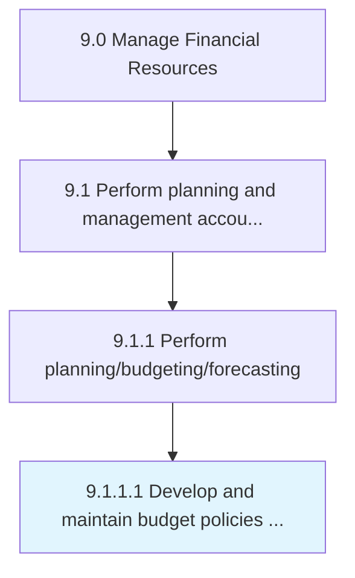

# Develop and maintain budget policies and procedures

> Formulating financial budgetary guidelines and strategies.

## Overview

Activity 9.1.1.1 is an activity within the Manage Financial Resources framework. 

Formulating financial budgetary guidelines and strategies. Develop a framework for rules and regulations regarding budgets. Create a step-by-step process to achieve financial goals.

## Process Hierarchy



## Key Statistics

| Metric | Value |
|--------|-------|
| APQC Code | 10771 |
| Hierarchy ID | 9.1.1.1 |
| Level | Activity |
| Parent | [9.1.1](../) |
| Sub-Processes | 0 |


## GraphDL Semantic Structure

```
develop.AndMaintainBudgetPoliciesAndProcedures
```

| Component | Value | Description |
|-----------|-------|-------------|
| Verb | `develop` | Primary action |
| Object | `and maintain budget policies and procedures` | Direct object |


## Related Concepts

- [BudgetPolicies](/concepts/BudgetPolicies)
- [Procedures](/concepts/Procedures)
- [BudgetPolicies](/concepts/BudgetPolicies)
- [Procedures](/concepts/Procedures)


---

*Source: APQC PCF 10771 (9.1.1.1) - APQC*
