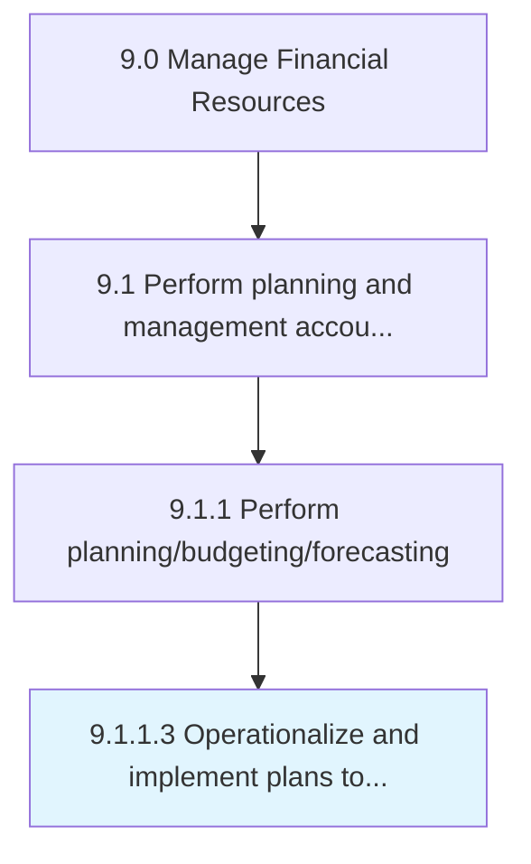

# Operationalize and implement plans to achieve budget

> Putting budgeting plans into practical use keeping within designated forecasting parameters.

## Overview

Activity 9.1.1.3 is an activity within the Manage Financial Resources framework. 

Putting budgeting plans into practical use keeping within designated forecasting parameters.

## Process Hierarchy



## Key Statistics

| Metric | Value |
|--------|-------|
| APQC Code | 20135 |
| Hierarchy ID | 9.1.1.3 |
| Level | Activity |
| Parent | [9.1.1](../) |
| Sub-Processes | 0 |


## GraphDL Semantic Structure

```
operationalize.AndImplementPlans.to.AchieveBudget
```

| Component | Value | Description |
|-----------|-------|-------------|
| Verb | `operationalize` | Primary action |
| Object | `and implement plans` | Direct object |
| Preposition | `to` | Relationship |
| PrepObject | `achieve budget` | Indirect object |


## Related Concepts

- [Plans](/concepts/Plans)
- [AchieveBudget](/concepts/AchieveBudget)
- [Plans](/concepts/Plans)
- [AchieveBudget](/concepts/AchieveBudget)


---

*Source: APQC PCF 20135 (9.1.1.3) - APQC*
