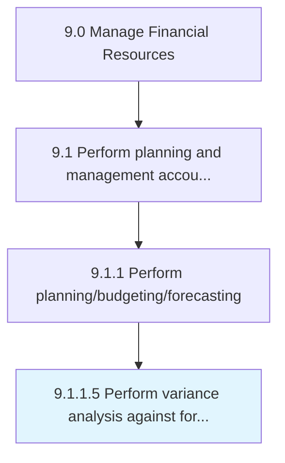

# Perform variance analysis against forecasts and budgets

> Conducting a quantitative analysis between what was forecasted and budgeted and actual financial behavior.

## Overview

Activity 9.1.1.5 is an activity within the Manage Financial Resources framework. 

Conducting a quantitative analysis between what was forecasted and budgeted and actual financial behavior.

## Process Hierarchy



## Key Statistics

| Metric | Value |
|--------|-------|
| APQC Code | 20136 |
| Hierarchy ID | 9.1.1.5 |
| Level | Activity |
| Parent | [9.1.1](../) |
| Sub-Processes | 0 |


## GraphDL Semantic Structure

```
perform.VarianceAnalysis.against.ForecastsAndBudgets
```

| Component | Value | Description |
|-----------|-------|-------------|
| Verb | `perform` | Primary action |
| Object | `variance analysis` | Direct object |
| Preposition | `against` | Relationship |
| PrepObject | `forecasts and budgets` | Indirect object |


## Related Concepts

- [VarianceAnalysis](/concepts/VarianceAnalysis)
- [Forecasts](/concepts/Forecasts)
- [Budgets](/concepts/Budgets)


---

*Source: APQC PCF 20136 (9.1.1.5) - APQC*
