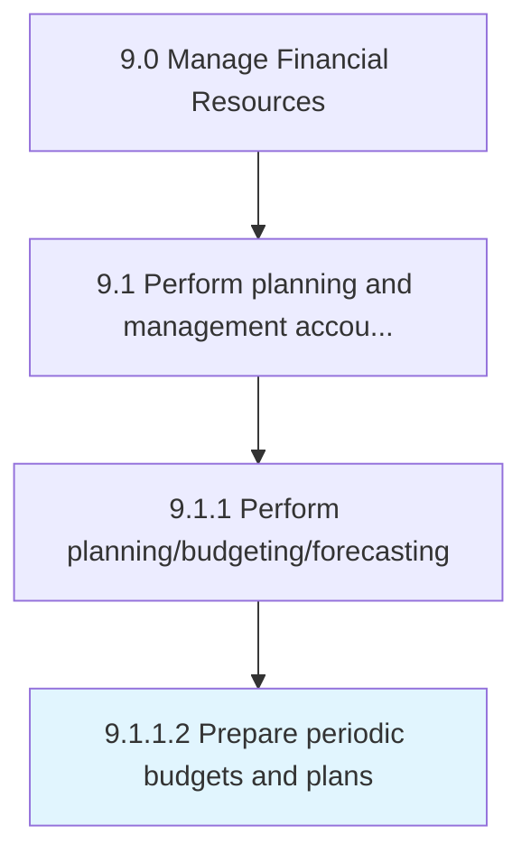

# Prepare periodic budgets and plans

> Creating reports on a quarterly or annual basis for fund allocation.

## Overview

Activity 9.1.1.2 is an activity within the Manage Financial Resources framework. 

Creating reports on a quarterly or annual basis for fund allocation. Create a financial statement that estimates revenues and expenses over a specific period of time. (Leverage budget methods such as cost-based and zero-based budgeting techniques, in light of the periodic targets outlined during Develop and maintain budget policies and procedures [10771].)

## Process Hierarchy



## Key Statistics

| Metric | Value |
|--------|-------|
| APQC Code | 10772 |
| Hierarchy ID | 9.1.1.2 |
| Level | Activity |
| Parent | [9.1.1](../) |
| Sub-Processes | 0 |


## GraphDL Semantic Structure

```
prepare.PeriodicBudgetsAndPlans
```

| Component | Value | Description |
|-----------|-------|-------------|
| Verb | `prepare` | Primary action |
| Object | `periodic budgets and plans` | Direct object |


## Related Concepts

- PeriodicBudgets
- Plans


---

*Source: APQC PCF 10772 (9.1.1.2) - APQC*
